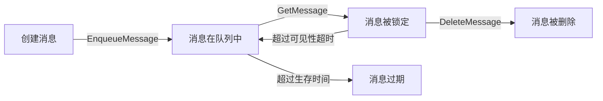
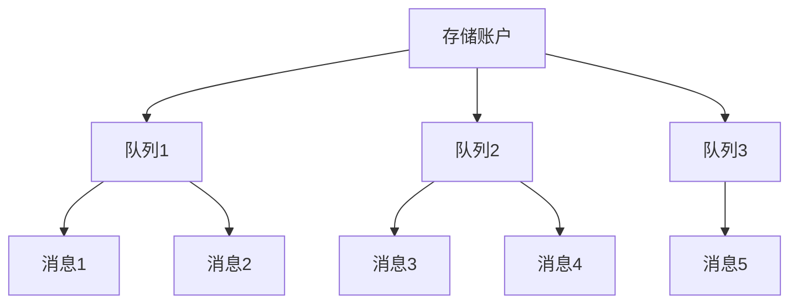
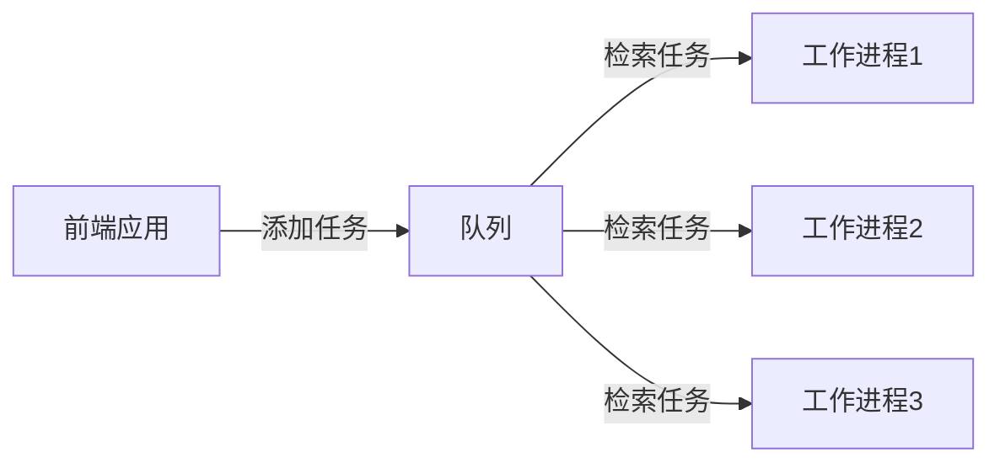

# Azure 队列存储

Azure 队列存储是 Microsoft 提供的云消息队列服务，用于在应用程序组件之间实现可靠的异步通信。本文档提供了 Azure 队列存储的全面概述、核心概念和使用指南。

## 目录

- [概述](#概述)
- [核心概念](#核心概念)
- [架构组件](#架构组件)
- [队列与消息属性](#队列与消息属性)
- [存储账户选项](#存储账户选项)
- [安全性](#安全性)
- [性能与扩展性](#性能与扩展性)
- [使用方法](#使用方法)
- [消息操作](#消息操作)
- [监控与诊断](#监控与诊断)
- [成本优化](#成本优化)
- [最佳实践](#最佳实践)
- [常见场景](#常见场景)
- [与其他 Azure 消息服务的比较](#与其他-azure-消息服务的比较)
- [常见问题](#常见问题)
- [其他资源](#其他资源)

## 概述

Azure 队列存储是一种服务，用于在应用程序组件之间存储大量消息。队列存储提供了一个简单、经济高效的异步消息传递解决方案，可以在云中、本地或两者之间进行通信。队列存储特别适合：

- **组件解耦**：使应用程序组件能够独立运行和扩展
- **负载均衡**：在高峰期分散工作负载
- **异步处理**：处理长时间运行的或批处理任务
- **工作流程控制**：构建工作流程和处理管道
- **微服务通信**：在微服务架构中实现可靠通信

**主要优势：**

- **简单集成**：使用标准 REST API 轻松集成到现有应用程序
- **可靠传递**：确保消息至少传递一次
- **持久性**：消息持久保存直到被处理
- **事务支持**：支持批处理操作
- **可访问性**：从任何地方通过 HTTP/HTTPS 访问
- **经济高效**：按使用量付费的定价模型

## 核心概念

### 存储账户

队列存储是通过 Azure 存储账户提供的。每个存储账户可以包含多个队列，每个队列可以存储大量消息。

### 队列

队列是消息的容器。队列名称必须是小写字母，可以包含数字和连字符，但必须以字母或数字开头。队列名称长度必须在 3 到 63 个字符之间。

### 消息

消息是队列中的单个单元。消息可以是任何格式，最大大小为 64 KB。消息在队列中保留的最长时间为 7 天（可配置）。

### 消息生命周期

Azure 队列存储中的消息生命周期如下：



1. **入队**：消息被添加到队列
2. **出队**：客户端检索消息，消息被临时锁定
3. **处理**：客户端处理消息
4. **删除**：处理成功后，客户端删除消息
5. **超时**：如果消息未被删除，锁定超时后消息再次可见

## 架构组件

Azure 队列存储架构由以下组件组成：

### 存储账户层次结构



### 队列终结点

每个队列都有一个唯一的 HTTP/HTTPS 终结点：

```
https://<storage-account-name>.queue.core.windows.net/<queue-name>
```

### 队列服务组件

- **前端**：处理客户端请求的 API 层
- **分区层**：管理消息分区和复制
- **存储层**：提供持久存储

## 队列与消息属性

### 队列属性

- **名称**：唯一标识队列的名称
- **URL**：队列的完整 URL 地址
- **近似消息计数**：队列中消息的近似数量
- **元数据**：可选的名称-值对，用于存储队列的附加信息

### 消息属性

- **内容**：消息的实际数据，最大 64 KB
- **ID**：系统生成的消息唯一标识符
- **插入时间**：消息添加到队列的时间
- **过期时间**：消息过期的时间
- **出队计数**：消息被检索的次数
- **可见性超时**：消息被锁定的时间段
- **弹出接收时间**：最近一次检索消息的时间

## 存储账户选项

Azure 队列存储可以在以下存储账户类型中使用：

| 存储账户类型 | 队列支持 | 特点 | 推荐使用场景 |
|------------|-------|------|------------|
| 通用 v2 (GPv2) | ✓ | 支持所有存储服务，标准性能 | 大多数场景 |
| 通用 v1 (GPv1) | ✓ | 旧版存储账户 | 仅用于兼容性 |
| 队列存储账户 | ✓ | 专用于队列存储 | 仅需队列存储时 |

## 安全性

Azure 队列存储提供多层安全功能：

### 数据加密

- **静态加密**：所有数据自动使用 Azure 存储服务加密 (SSE) 进行加密
- **传输中加密**：通过 HTTPS 进行安全传输
- **客户管理的密钥**：可选择使用自己的加密密钥

### 访问控制

- **共享密钥授权**：使用存储账户密钥
- **共享访问签名 (SAS)**：提供有限的访问权限
- **Azure Active Directory 集成**：基于身份的访问控制
- **基于角色的访问控制 (RBAC)**：精细的权限管理

### 网络安全

- **虚拟网络服务终结点**：将访问限制在特定虚拟网络内
- **防火墙规则**：基于 IP 地址限制访问
- **私有链接**：通过私有终结点访问存储账户

## 性能与扩展性

Azure 队列存储设计为高性能和高可扩展性：

### 性能目标

- **延迟**：通常低于 10 毫秒（对于小消息）
- **吞吐量**：单个队列每秒最多 2,000 个消息
- **容量**：单个队列最多可存储 500 TB 的数据

### 扩展限制

- **队列大小**：最高 500 TB
- **消息大小**：最大 64 KB
- **队列数量**：每个存储账户无限制（受存储账户容量限制）
- **消息生存时间**：最长 7 天（可配置）

### 性能优化

- 使用批处理操作减少网络往返
- 适当设置消息可见性超时
- 使用多个队列分散负载
- 考虑消息大小和格式

## 使用方法

### 创建队列

#### 使用 Azure 门户

1. 登录 Azure 门户
2. 导航到存储账户
3. 选择"队列"服务
4. 点击"+ 队列"
5. 输入队列名称并点击"确定"

#### 使用 Azure CLI

```bash
# 创建队列
az storage queue create \
    --name myqueue \
    --account-name mystorageaccount \
    --auth-mode login
```

#### 使用 PowerShell

```powershell
# 创建队列
New-AzStorageQueue -Name "myqueue" -Context $ctx
```

#### 使用 .NET SDK

```csharp
// 获取队列客户端
QueueServiceClient queueServiceClient = new QueueServiceClient(connectionString);

// 创建队列
QueueClient queueClient = queueServiceClient.CreateQueue("myqueue");
```

### 访问队列

Azure 队列存储可以通过多种方式访问：

1. **REST API**：直接使用 HTTP/HTTPS 请求
2. **客户端库**：各种编程语言的 SDK
3. **Azure 存储资源管理器**：图形界面工具
4. **Azure 门户**：Web 界面
5. **PowerShell 和 CLI**：命令行工具

## 消息操作

### 添加消息

#### 使用 .NET SDK

```csharp
// 添加消息
await queueClient.SendMessageAsync("Hello, Azure Queue Storage!");

// 添加带有 TTL 的消息（3天过期）
await queueClient.SendMessageAsync("Message with custom TTL", TimeSpan.FromDays(3));
```

### 查看消息

查看消息而不将其从队列中删除（窥视）：

```csharp
// 查看下一条消息
PeekedMessage peekedMessage = await queueClient.PeekMessageAsync();

// 查看多条消息
PeekedMessage[] peekedMessages = await queueClient.PeekMessagesAsync(maxMessages: 10);
```

### 接收和处理消息

```csharp
// 接收消息（默认可见性超时为 30 秒）
QueueMessage message = await queueClient.ReceiveMessageAsync();

// 接收消息并设置可见性超时
QueueMessage message = await queueClient.ReceiveMessageAsync(TimeSpan.FromMinutes(5));

// 处理消息
Console.WriteLine($"消息内容: {message.MessageText}");

// 删除消息
await queueClient.DeleteMessageAsync(message.MessageId, message.PopReceipt);
```

### 更新消息

```csharp
// 更新消息内容并延长可见性超时
QueueMessage message = await queueClient.ReceiveMessageAsync();
await queueClient.UpdateMessageAsync(
    message.MessageId, 
    message.PopReceipt,
    "Updated message content",
    TimeSpan.FromMinutes(10));
```

### 批量操作

```csharp
// 批量接收消息
QueueMessage[] messages = await queueClient.ReceiveMessagesAsync(maxMessages: 20);

// 处理消息
foreach (QueueMessage message in messages)
{
    // 处理消息
    await queueClient.DeleteMessageAsync(message.MessageId, message.PopReceipt);
}
```

## 监控与诊断

### Azure Monitor

使用 Azure Monitor 监控队列存储的性能和操作：

- **指标**：事务数、可用性、延迟、容量等
- **日志**：详细的请求日志、存储分析日志

### 存储分析

启用存储分析以记录详细的请求信息：

```powershell
# 启用存储分析日志
Set-AzStorageServiceLoggingProperty -ServiceType Queue `
    -LoggingOperations read,write,delete `
    -RetentionDays 10 `
    -Context $ctx
```

## 成本优化

优化 Azure 队列存储成本的策略：

1. **选择合适的存储账户**：根据需求选择最合适的存储账户类型
2. **批处理操作**：使用批处理减少事务数量
3. **适当的消息 TTL**：设置合理的消息生存时间
4. **删除处理完的消息**：及时删除已处理的消息
5. **监控使用情况**：定期检查使用情况并清理不需要的队列

## 最佳实践

### 设计最佳实践

- **消息设计**：保持消息小巧，仅包含必要数据或引用
- **队列分片**：对于高吞吐量场景，考虑使用多个队列
- **幂等处理**：设计消息处理逻辑为幂等操作，以处理重复消息
- **消息格式**：使用结构化格式（如 JSON）提高可读性和可维护性

### 操作最佳实践

- **适当的可见性超时**：根据处理时间设置合理的可见性超时
- **指数退避重试**：实施指数退避策略处理临时故障
- **死信处理**：实现死信队列处理无法处理的消息
- **监控队列长度**：监控队列长度以检测积压

### 性能最佳实践

- **批处理操作**：使用批处理减少网络往返
- **异步操作**：使用异步 API 提高应用程序响应能力
- **并行处理**：使用多个工作线程并行处理消息
- **预取**：一次检索多条消息以减少 API 调用

### 安全最佳实践

- **使用 HTTPS**：始终使用 HTTPS 进行数据传输
- **限制 SAS 令牌**：限制共享访问签名的范围和持续时间
- **实施网络安全控制**：使用服务终结点和防火墙规则
- **定期轮换访问密钥**：定期更新存储账户密钥

## 常见场景

### 工作队列

使用队列分发工作到多个工作进程：

1. 前端应用程序将任务作为消息添加到队列
2. 后端工作进程从队列中检索消息
3. 工作进程处理任务并删除消息
4. 多个工作进程可以并行处理消息



### 负载均衡

使用队列在高峰期分散工作负载：

1. 在高峰期，请求速率可能超过处理能力
2. 将请求作为消息添加到队列
3. 工作进程以自己的速度处理消息
4. 队列充当缓冲区，防止系统过载

### 异步通信

使用队列实现微服务之间的松耦合通信：

1. 服务 A 将消息添加到队列
2. 服务 B 从队列中检索消息
3. 服务 A 和 B 可以独立扩展和部署
4. 即使服务 B 暂时不可用，消息也会保留在队列中

### 批处理操作

使用队列收集需要批处理的操作：

1. 应用程序将需要处理的项目添加到队列
2. 批处理工作进程定期从队列中检索多条消息
3. 工作进程批量处理这些项目
4. 批处理提高了效率和性能

## 与其他 Azure 消息服务的比较

Azure 提供多种消息传递服务，每种服务都有不同的功能和用例：

| 功能 | Azure 队列存储 | Azure 服务总线队列 | Azure 事件中心 | Azure 事件网格 |
|------|--------------|-------------------|--------------|--------------|
| 用例 | 简单队列 | 高级队列和主题 | 大规模事件流 | 事件分发 |
| 消息大小 | 最大 64 KB | 最大 1 MB | 最大 1 MB | 最大 1 MB |
| 消息排序 | 不保证 | 支持 | 支持（每分区） | 不保证 |
| 批处理 | 支持 | 支持 | 支持 | 支持 |
| 事务 | 支持 | 支持 | 不支持 | 不支持 |
| 重复检测 | 不支持 | 支持 | 不支持 | 不支持 |
| 自动死信 | 不支持 | 支持 | 不支持 | 不支持 |
| 价格 | 低 | 中 | 中-高 | 低-中 |

### 何时选择 Azure 队列存储

- 需要简单、经济高效的队列解决方案
- 消息大小小于 64 KB
- 队列大小可能超过 80 GB
- 不需要高级功能（如主题、死信队列、会话）
- 需要简单的 REST API 访问

### 何时选择其他消息服务

- **服务总线队列**：需要高级功能，如事务、重复检测、主题/订阅
- **事件中心**：需要处理高吞吐量事件流，如遥测数据
- **事件网格**：需要基于事件的架构和事件分发

## 常见问题

### 如何处理大型消息？

Azure 队列存储限制单个消息大小为 64 KB。对于更大的数据：

1. **使用 Blob 存储**：将大型数据存储在 Blob 中，在队列消息中存储引用
2. **拆分消息**：将大型消息拆分为多个小消息，并在处理时重新组合
3. **考虑服务总线**：Azure 服务总线队列支持最大 1 MB 的消息

```csharp
// 存储大型数据到 Blob 并在队列中引用
BlobClient blobClient = new BlobClient(connectionString, "mycontainer", "myblob");
await blobClient.UploadAsync(largeDataStream);

// 在队列消息中存储引用
await queueClient.SendMessageAsync($"{{\"blobReference\": \"mycontainer/myblob\"}}");
```

### 如何处理消息重试和死信？

Azure 队列存储没有内置的死信队列功能，但可以实现自定义解决方案：

1. **跟踪重试次数**：在消息内容中包含重试计数
2. **创建死信队列**：创建单独的队列用于存储无法处理的消息
3. **实施重试逻辑**：检查重试计数并决定是否继续处理或移至死信队列

```csharp
// 接收消息
QueueMessage message = await queueClient.ReceiveMessageAsync();

// 解析消息内容（假设是 JSON）
var messageData = JsonSerializer.Deserialize<MessageData>(message.MessageText);

try {
    // 处理消息
    ProcessMessage(messageData);
    
    // 处理成功，删除消息
    await queueClient.DeleteMessageAsync(message.MessageId, message.PopReceipt);
}
catch (Exception) {
    // 增加重试计数
    messageData.RetryCount++;
    
    if (messageData.RetryCount < 3) {
        // 更新消息并放回队列
        await queueClient.UpdateMessageAsync(
            message.MessageId,
            message.PopReceipt,
            JsonSerializer.Serialize(messageData),
            TimeSpan.FromSeconds(0)); // 立即可见
    }
    else {
        // 移至死信队列
        QueueClient deadLetterQueueClient = new QueueClient(connectionString, "deadletter");
        await deadLetterQueueClient.SendMessageAsync(JsonSerializer.Serialize(messageData));
        
        // 从原队列中删除
        await queueClient.DeleteMessageAsync(message.MessageId, message.PopReceipt);
    }
}
```

### 如何实现队列监控和警报？

1. **Azure Monitor**：设置指标警报监控队列长度和操作
2. **自定义监控**：实现定期检查队列长度的自定义监控
3. **日志分析**：使用 Azure Monitor 日志分析队列操作模式

```csharp
// 检查队列长度并记录
QueueProperties properties = await queueClient.GetPropertiesAsync();
int messageCount = properties.ApproximateMessagesCount;

if (messageCount > threshold) {
    // 触发警报或扩展处理能力
}
```

## 其他资源

- [Azure 队列存储官方文档](https://docs.microsoft.com/zh-cn/azure/storage/queues/)
- [Azure 队列存储 REST API 参考](https://docs.microsoft.com/zh-cn/rest/api/storageservices/queue-service-rest-api)
- [Azure 存储资源管理器](https://azure.microsoft.com/zh-cn/features/storage-explorer/)
- [队列存储示例](https://docs.microsoft.com/zh-cn/samples/browse/?products=azure-storage&terms=queue)
- [Azure 队列存储定价](https://azure.microsoft.com/zh-cn/pricing/details/storage/queues/) 