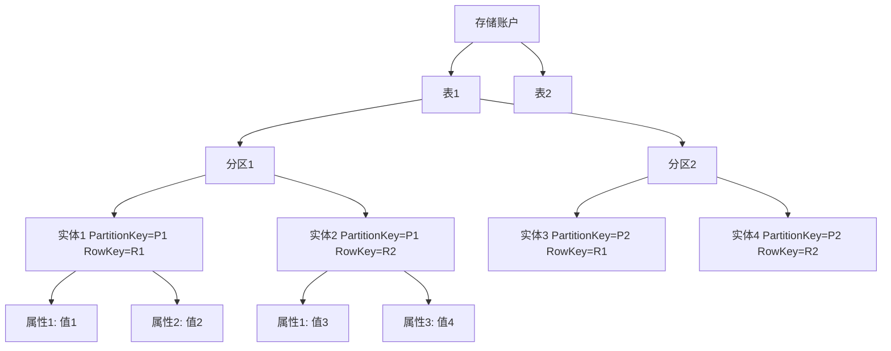

# Azure 表存储

Azure 表存储是 Microsoft 提供的 NoSQL 键值存储服务，用于存储大量结构化数据。本文档提供了 Azure 表存储的全面概述、核心概念和使用指南。

## 目录

- [概述](#概述)
- [核心概念](#核心概念)
- [数据模型](#数据模型)
- [分区策略](#分区策略)
- [存储账户选项](#存储账户选项)
- [安全性](#安全性)
- [性能与扩展性](#性能与扩展性)
- [使用方法](#使用方法)
- [数据操作](#数据操作)
- [查询功能](#查询功能)
- [监控与诊断](#监控与诊断)
- [成本优化](#成本优化)
- [最佳实践](#最佳实践)
- [常见场景](#常见场景)
- [与 Cosmos DB 表 API 的比较](#与-cosmos-db-表-api-的比较)
- [常见问题](#常见问题)
- [其他资源](#其他资源)

## 概述

Azure 表存储是一种 NoSQL 数据存储服务，用于存储大量结构化非关系型数据。它是一个键/属性存储，具有无架构设计，使其不同于传统的关系数据库。表存储特别适合：

- 存储 TB 级结构化数据
- 存储需要快速访问的数据集
- 查询具有简单筛选条件的大型数据集
- 需要经济高效的存储解决方案
- 需要灵活数据模式的应用程序

**主要优势：**

- **经济高效**：相比传统关系数据库，成本更低
- **无架构**：灵活的数据模式，无需预定义结构
- **高可用性**：99.999% 的读取可用性
- **自动扩展**：自动分区以适应数据增长
- **简单集成**：与 Azure 服务和开发工具的无缝集成
- **全托管**：无需管理基础设施或数据库软件

## 核心概念

### 存储账户

表存储是通过 Azure 存储账户提供的。每个存储账户可以包含多个表，每个表可以存储大量实体（行）。

### 表

表是实体（行）的集合。与关系数据库中的表不同，Azure 表存储中的表没有强制的架构，这意味着同一个表中的不同实体可以有不同的属性集。

### 实体

实体类似于数据库行或记录，是属性的集合。Azure 表存储中的实体最多可以存储 255 个属性，总大小最大为 1MB。

### 属性

属性类似于数据库列，是名称-值对。每个实体可以有不同的属性集，但必须包含三个系统属性：

- **PartitionKey**：确定实体存储在哪个分区中
- **RowKey**：在分区内唯一标识实体
- **Timestamp**：由 Azure 表存储维护，用于并发控制

PartitionKey 和 RowKey 的组合形成实体的唯一标识符（主键）。

## 数据模型

Azure 表存储使用以下数据模型：



### 支持的数据类型

Azure 表存储支持以下数据类型：

- **String**：UTF-16 字符串
- **Binary**：最大 64KB 的二进制数据
- **Bool**：布尔值
- **DateTime**：64位值，表示为 UTC 日期时间
- **Double**：64位浮点值
- **GUID**：128位全局唯一标识符
- **Int32**：32位整数
- **Int64**：64位整数

## 分区策略

分区是 Azure 表存储中的重要概念，它直接影响性能和可扩展性：

### 分区键的作用

- **数据分布**：Azure 使用分区键将数据分布到多个存储节点
- **事务范围**：同一分区内的实体可以参与原子事务
- **查询效率**：包含分区键的查询更高效

### 分区键设计原则

1. **均匀分布**：选择能够使数据均匀分布的分区键
2. **访问模式匹配**：根据查询模式设计分区键
3. **避免热分区**：防止单个分区接收大部分流量
4. **考虑扩展性**：随着数据增长，分区策略应保持有效

### 行键设计原则

1. **唯一性**：在分区内保持唯一
2. **排序**：行键决定分区内的排序顺序
3. **查询效率**：经常用于点查询和范围查询的值适合作为行键

## 存储账户选项

Azure 表存储可以在以下存储账户类型中使用：

| 存储账户类型 | 表支持 | 特点 | 推荐使用场景 |
|------------|-------|------|------------|
| 通用 v2 (GPv2) | ✓ | 支持所有存储服务，标准性能 | 大多数场景 |
| 通用 v1 (GPv1) | ✓ | 旧版存储账户 | 仅用于兼容性 |
| 表存储账户 | ✓ | 专用于表存储 | 仅需表存储时 |

## 安全性

Azure 表存储提供多层安全功能：

### 数据加密

- **静态加密**：所有数据自动使用 Azure 存储服务加密 (SSE) 进行加密
- **传输中加密**：通过 HTTPS 进行安全传输
- **客户管理的密钥**：可选择使用自己的加密密钥

### 访问控制

- **共享密钥授权**：使用存储账户密钥
- **共享访问签名 (SAS)**：提供有限的访问权限
- **Azure Active Directory 集成**：基于身份的访问控制
- **基于角色的访问控制 (RBAC)**：精细的权限管理

### 网络安全

- **虚拟网络服务终结点**：将访问限制在特定虚拟网络内
- **防火墙规则**：基于 IP 地址限制访问
- **私有链接**：通过私有终结点访问存储账户

## 性能与扩展性

Azure 表存储设计为高性能和高可扩展性：

### 性能目标

- **延迟**：通常低于 10 毫秒（对于 1KB 实体的读取）
- **吞吐量**：单个分区每秒最多 2,000 个事务
- **容量**：单个表最多可存储 500 TB 的数据

### 扩展限制

- **表大小**：最高 500 TB
- **实体大小**：最大 1 MB
- **属性数量**：每个实体最多 255 个属性
- **表数量**：每个存储账户无限制（受存储账户容量限制）

### 性能优化

- 使用高效的分区键设计
- 避免跨分区查询
- 使用批处理操作
- 考虑实体组事务

## 使用方法

### 创建表

#### 使用 Azure 门户

1. 登录 Azure 门户
2. 导航到存储账户
3. 选择"表"服务
4. 点击"+ 表"
5. 输入表名并点击"确定"

#### 使用 Azure CLI

```bash
# 创建表
az storage table create \
    --name mytable \
    --account-name mystorageaccount \
    --auth-mode login
```

#### 使用 PowerShell

```powershell
# 创建表
New-AzStorageTable -Name "mytable" -Context $ctx
```

#### 使用 .NET SDK

```csharp
// 获取表客户端
TableServiceClient tableServiceClient = new TableServiceClient(connectionString);

// 创建表
TableClient tableClient = tableServiceClient.CreateTableIfNotExists("mytable");
```

### 访问表

Azure 表存储可以通过多种方式访问：

1. **REST API**：直接使用 HTTP/HTTPS 请求
2. **客户端库**：各种编程语言的 SDK
3. **Azure 存储资源管理器**：图形界面工具
4. **Azure 门户**：Web 界面
5. **PowerShell 和 CLI**：命令行工具

## 数据操作

### 添加实体

#### 使用 .NET SDK

```csharp
// 创建实体
var entity = new TableEntity("partitionKey", "rowKey")
{
    ["ProductName"] = "Widget",
    ["Price"] = 25.99,
    ["Quantity"] = 100,
    ["OnSale"] = true
};

// 添加实体
tableClient.AddEntity(entity);
```

### 读取实体

#### 使用 .NET SDK

```csharp
// 读取单个实体
TableEntity entity = tableClient.GetEntity<TableEntity>("partitionKey", "rowKey");

// 访问属性
string productName = entity.GetString("ProductName");
double price = entity.GetDouble("Price");
```

### 更新实体

#### 使用 .NET SDK

```csharp
// 获取实体
TableEntity entity = tableClient.GetEntity<TableEntity>("partitionKey", "rowKey");

// 修改属性
entity["Price"] = 29.99;
entity["OnSale"] = false;

// 更新实体
tableClient.UpdateEntity(entity, ETag.All, TableUpdateMode.Replace);
```

### 删除实体

#### 使用 .NET SDK

```csharp
// 删除实体
tableClient.DeleteEntity("partitionKey", "rowKey");
```

### 批量操作

#### 使用 .NET SDK

```csharp
// 创建批处理操作
List<TableTransactionAction> actions = new List<TableTransactionAction>();

// 添加操作
actions.Add(new TableTransactionAction(TableTransactionActionType.Add, 
    new TableEntity("partitionKey", "rowKey1") { ["Property"] = "Value1" }));
actions.Add(new TableTransactionAction(TableTransactionActionType.Add, 
    new TableEntity("partitionKey", "rowKey2") { ["Property"] = "Value2" }));

// 提交批处理（注意：批处理操作仅适用于同一分区组内的实体）
tableClient.SubmitTransaction(actions);
```

## 查询功能

Azure 表存储提供多种查询数据的方法：

### 点查询

点查询是最高效的查询类型，使用分区键和行键检索单个实体：

```csharp
// 点查询
TableEntity entity = tableClient.GetEntity<TableEntity>("partitionKey", "rowKey");
```

### 分区查询

查询单个分区内的所有实体：

```csharp
// 分区查询
var entities = tableClient.Query<TableEntity>(filter: $"PartitionKey eq 'partitionKey'");
```

### 范围查询

在单个分区内按行键范围查询：

```csharp
// 范围查询
var entities = tableClient.Query<TableEntity>(
    filter: $"PartitionKey eq 'partitionKey' and RowKey ge 'A' and RowKey lt 'N'");
```

### 属性查询

按非键属性查询（效率较低）：

```csharp
// 属性查询
var entities = tableClient.Query<TableEntity>(
    filter: $"Price gt 20.00 and Category eq 'Electronics'");
```

### 投影

只检索特定属性：

```csharp
// 投影查询
var entities = tableClient.Query<TableEntity>(
    filter: $"PartitionKey eq 'partitionKey'",
    select: new List<string> { "ProductName", "Price" });
```

## 监控与诊断

### Azure Monitor

使用 Azure Monitor 监控表存储的性能和操作：

- **指标**：事务数、可用性、延迟、容量等
- **日志**：详细的请求日志、存储分析日志

### 存储分析

启用存储分析以记录详细的请求信息：

```powershell
# 启用存储分析日志
Set-AzStorageServiceLoggingProperty -ServiceType Table `
    -LoggingOperations read,write,delete `
    -RetentionDays 10 `
    -Context $ctx
```

## 成本优化

优化 Azure 表存储成本的策略：

1. **选择合适的存储账户**：根据需求选择最合适的存储账户类型
2. **有效使用分区**：设计良好的分区策略可以减少事务成本
3. **批处理操作**：使用批处理减少事务数量
4. **精简数据**：只存储必要的属性
5. **适当的数据生命周期管理**：定期删除不需要的数据

## 最佳实践

### 数据建模最佳实践

- **分区键设计**：选择能够均匀分布数据且匹配访问模式的分区键
- **行键设计**：根据查询模式设计行键，利用排序特性
- **非规范化**：适当复制数据以优化查询性能
- **实体设计**：保持实体小巧，仅包含必要属性

### 查询最佳实践

- **优先使用点查询**：尽可能使用分区键和行键进行查询
- **避免全表扫描**：始终在查询中包含分区键
- **限制返回的属性**：使用投影只返回需要的属性
- **分页处理**：处理大型结果集时使用分页

### 性能最佳实践

- **批处理操作**：使用批处理减少网络往返
- **并行操作**：对不同分区的操作可以并行执行
- **避免热分区**：防止单个分区接收大部分流量
- **考虑时间敏感的分区键**：对于时间序列数据，考虑使用时间戳作为分区键的一部分

### 安全最佳实践

- **使用 HTTPS**：始终使用 HTTPS 进行数据传输
- **限制 SAS 令牌**：限制共享访问签名的范围和持续时间
- **实施网络安全控制**：使用服务终结点和防火墙规则
- **定期轮换访问密钥**：定期更新存储账户密钥

## 常见场景

### 日志数据存储

表存储非常适合存储日志数据：

1. 使用时间戳（反向）作为分区键的一部分
2. 使用事件 ID 或序列号作为行键
3. 利用表存储的自动分区扩展处理大量日志

### 用户数据和配置

存储用户配置文件或应用程序配置：

1. 使用用户 ID 或应用程序 ID 作为分区键
2. 使用配置类型或时间戳作为行键
3. 利用表存储的灵活架构适应不同的配置结构

### IoT 数据存储

存储来自物联网设备的遥测数据：

1. 使用设备 ID 或设备类型作为分区键
2. 使用时间戳作为行键
3. 利用表存储的低成本和高吞吐量处理大量传感器数据

### 产品目录

存储产品信息：

1. 使用产品类别作为分区键
2. 使用产品 ID 作为行键
3. 利用表存储的灵活架构处理不同类型的产品属性

## 与 Cosmos DB 表 API 的比较

Azure Cosmos DB 提供了表 API，与 Azure 表存储兼容但具有更多功能：

| 功能 | Azure 表存储 | Cosmos DB 表 API |
|------|------------|-----------------|
| 延迟 | 低（毫秒级） | 超低（个位数毫秒） |
| 吞吐量 | 变化的，无法预留 | 可预留和扩展 |
| 全球分布 | 仅限 GRS/RA-GRS | 多区域写入 |
| 索引 | 仅限分区键和行键 | 自动索引所有属性 |
| 查询能力 | 基本 | 增强 |
| 一致性级别 | 强一致性 | 五种可配置级别 |
| 价格 | 更低 | 更高，但功能更丰富 |

### 何时选择 Azure 表存储

- 需要经济高效的存储解决方案
- 数据访问模式简单
- 存储容量需求大于吞吐量需求
- 不需要高级功能（如全球分布、多区域写入）

### 何时选择 Cosmos DB 表 API

- 需要低延迟保证
- 需要全球分布
- 需要更丰富的查询功能
- 需要多种一致性级别
- 愿意为高级功能支付更高费用

## 常见问题

### 如何处理大型实体？

Azure 表存储限制单个实体大小为 1MB。对于更大的数据：

1. **拆分实体**：将大型实体拆分为多个相关实体
2. **使用 Blob 存储**：将大型数据存储在 Blob 中，在表实体中存储引用
3. **考虑其他服务**：对于需要存储大型数据的场景，考虑 Cosmos DB 或其他数据库服务

### 如何实现表存储的备份？

1. **AzCopy**：使用 AzCopy 工具复制表数据
2. **自定义备份**：编写脚本定期导出数据
3. **存储账户复制**：使用 GRS/RA-GRS 提供地理冗余

```bash
# 使用 AzCopy 备份表
azcopy copy "https://mystorageaccount.table.core.windows.net/mytable" "https://backupaccount.table.core.windows.net/mytablebackup" --recursive
```

### 如何处理表存储中的并发？

Azure 表存储使用乐观并发控制：

1. **ETag**：每个实体都有一个 ETag，在更新时可以检查
2. **条件更新**：只有当 ETag 匹配时才更新实体
3. **合并更新**：使用合并操作只更新特定属性

```csharp
// 条件更新示例
try
{
    entity["Price"] = 29.99;
    tableClient.UpdateEntity(entity, entity.ETag, TableUpdateMode.Replace);
}
catch (RequestFailedException ex) when (ex.Status == 412)
{
    // 处理并发冲突
    Console.WriteLine("实体已被其他进程修改");
}
```

## 其他资源

- [Azure 表存储官方文档](https://docs.microsoft.com/zh-cn/azure/storage/tables/)
- [Azure 表存储设计指南](https://docs.microsoft.com/zh-cn/azure/storage/tables/table-storage-design-guide)
- [Azure 存储资源管理器](https://azure.microsoft.com/zh-cn/features/storage-explorer/)
- [Azure 表存储 REST API 参考](https://docs.microsoft.com/zh-cn/rest/api/storageservices/table-service-rest-api)
- [Azure 表存储定价](https://azure.microsoft.com/zh-cn/pricing/details/storage/tables/) 