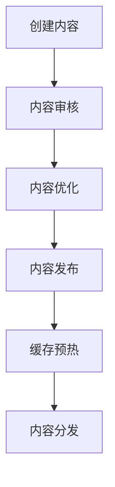

# AWS高性能内容管理系统架构案例研究

## 目录
- [系统概述](#系统概述)
- [架构设计](#架构设计)
- [性能优化](#性能优化)
- [内容工作流](#内容工作流)
- [系统集成](#系统集成)
- [运维管理](#运维管理)
- [成本控制](#成本控制)
- [最佳实践](#最佳实践)

## 系统概述

本案例展示了一个基于AWS构建的高性能内容管理系统(CMS)解决方案，适用于新闻媒体、企业门户、电子商务等场景的内容平台建设。

### 系统特点

- 全球内容快速分发
- 高并发内容访问
- 灵活的内容管理
- 智能媒体处理
- 强大的搜索能力
- 多端内容适配

## 架构设计

### 整体架构

```yaml
Architecture:
  Frontend:
    - CloudFront: 全球CDN分发
    - S3: 静态资源存储
    - WAF: Web应用防火墙
  
  Application:
    - API Gateway: RESTful API管理
    - Lambda: 无服务器计算
    - ECS: 容器化服务
    
  Storage:
    - S3: 媒体存储
    - RDS: 结构化数据
    - ElasticSearch: 内容搜索
    - DynamoDB: 元数据存储
    
  Processing:
    - MediaConvert: 媒体转码
    - Rekognition: 图像处理
    - Comprehend: 文本分析
```

### 核心服务组件

#### 内容存储层
- **S3**：存储原始媒体文件
- **RDS**：存储文章、用户数据
- **DynamoDB**：存储元数据、标签
- **ElasticCache**：热点内容缓存

#### 内容处理层
- **Lambda**：触发式处理
- **MediaConvert**：视频转码
- **Rekognition**：图像分析
- **Comprehend**：文本分析
- **Elasticsearch**：全文搜索

#### 内容分发层
- **CloudFront**：全球CDN
- **Route 53**：DNS管理
- **API Gateway**：API管理

## 性能优化

### 多级缓存策略

```yaml
CacheStrategy:
  L1_Browser:
    - 类型: 浏览器缓存
    - 策略: Cache-Control
    - 时间: 动态内容5分钟，静态资源7天
    
  L2_CDN:
    - 类型: CloudFront缓存
    - 策略: 基于路径和查询参数
    - 时间: 图片24小时，HTML 5分钟
    
  L3_Application:
    - 类型: ElastiCache
    - 策略: LRU淘汰
    - 时间: 热点内容1小时
    
  L4_Database:
    - 类型: 数据库查询缓存
    - 策略: 预加载+按需缓存
    - 时间: 30分钟自动失效
```

### 图片优化处理

```yaml
ImageProcessing:
  Formats:
    - WebP: 主流浏览器
    - AVIF: 新一代格式
    - JPG: 降级方案
    
  Resolutions:
    - 2x: 视网膜屏幕
    - 1x: 标准屏幕
    - 0.5x: 缩略图
    
  Optimization:
    - 压缩级别: 85%质量
    - 渐进式加载: true
    - 自动格式选择: true
```

### 内容预热策略

```yaml
PrewarmStrategy:
  Scheduled:
    - 首页内容: 每5分钟
    - 热门文章: 每小时
    - 分类页面: 每6小时
    
  EventDriven:
    - 新发布内容: 立即预热
    - 热门上升内容: 触发式预热
    - 编辑推荐内容: 手动预热
```

## 内容工作流

### 发布工作流



### 媒体处理工作流

```yaml
MediaWorkflow:
  Image:
    - 上传验证
    - 格式转换
    - 尺寸优化
    - 智能裁剪
    - CDN分发
    
  Video:
    - 转码适配
    - 清晰度生成
    - 封面提取
    - 字幕处理
    - 播放器优化
```

## 系统集成

### API设计

```yaml
API:
  Content:
    - GET /api/v1/articles:
        description: 获取文章列表
        cache: 5分钟
        
    - GET /api/v1/articles/{id}:
        description: 获取文章详情
        cache: 10分钟
        
    - POST /api/v1/articles:
        description: 创建新文章
        authentication: required
        
  Media:
    - POST /api/v1/media/upload:
        description: 上传媒体文件
        maxSize: 100MB
        
    - GET /api/v1/media/{id}/variants:
        description: 获取媒体变体
        cache: 24小时
```

### 搜索优化

```yaml
SearchOptimization:
  Indexing:
    - 实时索引更新
    - 定期重建索引
    - 同义词处理
    
  Features:
    - 全文搜索
    - faceted搜索
    - 相关性排序
    - 搜索建议
```

## 运维管理

### 监控指标

```yaml
Monitoring:
  Performance:
    - 页面加载时间
    - API响应时间
    - 缓存命中率
    - CDN性能
    
  Resources:
    - CPU使用率
    - 内存使用率
    - 存储使用量
    - 带宽使用量
    
  Business:
    - PV/UV统计
    - 内容访问量
    - 用户行为
    - 转化率
```

### 告警策略

```yaml
Alerts:
  HighPriority:
    - 服务不可用
    - 严重性能下降
    - 安全威胁
    
  MediumPriority:
    - 缓存命中率下降
    - API延迟增加
    - 存储空间预警
    
  LowPriority:
    - 非核心功能异常
    - 性能轻微波动
    - 资源使用预警
```

## 成本控制

### 优化策略

1. **存储优化**
   - S3生命周期管理
   - 冷热数据分层
   - 自动清理过期内容

2. **计算优化**
   - Lambda函数优化
   - 容器资源调度
   - 自动扩缩容

3. **带宽优化**
   - CDN流量优化
   - 图片压缩策略
   - 视频码率优化

## 最佳实践

### 性能最佳实践

1. **内容分发**
   - 使用多区域CDN
   - 实施多级缓存
   - 采用智能路由

2. **媒体处理**
   - 自适应格式转换
   - 智能质量控制
   - 按需生成变体

3. **API优化**
   - 实施API缓存
   - 使用GraphQL聚合
   - 控制响应大小

### 安全最佳实践

```yaml
SecurityPractices:
  AccessControl:
    - IAM角色管理
    - 细粒度权限
    - 访问审计
    
  ContentSecurity:
    - 内容加密
    - 防盗链
    - 水印处理
    
  NetworkSecurity:
    - WAF防护
    - DDoS防护
    - SSL/TLS加密
```

### 部署示例

```yaml
# CloudFormation部署模板
Resources:
  ContentAPI:
    Type: AWS::Serverless::Api
    Properties:
      StageName: prod
      Cors:
        AllowMethods: ['GET', 'POST', 'PUT', 'DELETE']
        AllowHeaders: ['Content-Type', 'Authorization']
        AllowOrigin: '*'
      
  MediaBucket:
    Type: AWS::S3::Bucket
    Properties:
      BucketName: !Sub ${AWS::StackName}-media
      CorsConfiguration:
        CorsRules:
          - AllowedHeaders: ['*']
            AllowedMethods: ['GET', 'PUT', 'POST', 'DELETE']
            AllowedOrigins: ['*']
            MaxAge: 3600

  ContentDatabase:
    Type: AWS::RDS::DBInstance
    Properties:
      Engine: aurora-postgresql
      DBInstanceClass: db.r5.large
      MultiAZ: true
      StorageEncrypted: true
```

### 扩展建议

1. **功能扩展**
   - AI内容生成
   - 个性化推荐
   - 实时协作
   - 多语言支持

2. **架构扩展**
   - 多区域部署
   - 跨账号管理
   - 混合云集成
   - 微服务解耦

3. **运维扩展**
   - 自动化运维
   - 智能监控
   - 容灾备份
   - 安全加固 