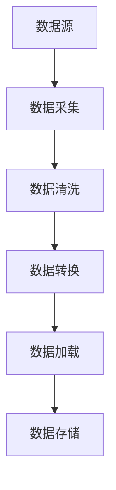

# AWS企业级数据湖与分析平台架构案例研究

## 目录
- [系统概述](#系统概述)
- [架构设计](#架构设计)
- [数据流程](#数据流程)
- [分析能力](#分析能力)
- [数据治理](#数据治理)
- [性能优化](#性能优化)
- [安全合规](#安全合规)
- [成本优化](#成本优化)
- [最佳实践](#最佳实践)

## 系统概述

本案例展示了一个基于AWS构建的企业级数据湖与分析平台解决方案，支持PB级数据存储、实时流处理、批量分析和机器学习等场景。

### 系统特点

- 统一数据湖架构
- 实时数据处理能力
- 弹性计算资源
- 多维分析能力
- 机器学习支持
- 完整数据治理

## 架构设计

### 整体架构

```yaml
Architecture:
  DataIngestion:
    - Kinesis: 实时数据接入
    - DMS: 数据库迁移
    - Glue: ETL处理
    - Transfer Family: 文件传输
    
  DataStorage:
    - S3: 数据湖存储
    - Lake Formation: 数据湖管理
    - RDS: 结构化数据
    - DynamoDB: 实时数据
    
  DataProcessing:
    - EMR: 大数据处理
    - Redshift: 数据仓库
    - Athena: 即席查询
    - Glue: 数据目录
    
  Analytics:
    - QuickSight: BI可视化
    - SageMaker: 机器学习
    - OpenSearch: 搜索分析
    - Kinesis Analytics: 流分析
```

### 核心组件说明

#### 数据接入层
- **Kinesis**：实时数据流接入
- **DMS**：数据库迁移服务
- **Glue**：ETL任务处理
- **Transfer Family**：安全文件传输

#### 存储层
- **S3**：对象存储（数据湖核心）
- **Lake Formation**：数据湖权限管理
- **RDS**：关系型数据库
- **DynamoDB**：NoSQL数据库

#### 计算层
- **EMR**：Hadoop生态系统
- **Redshift**：数据仓库
- **Athena**：交互式查询
- **Glue**：无服务器ETL

#### 分析层
- **QuickSight**：商业智能
- **SageMaker**：机器学习平台
- **OpenSearch**：搜索与分析
- **Kinesis Analytics**：流数据分析

## 数据流程

### 数据接入流程

```yaml
DataIngestionFlow:
  BatchIngestion:
    - Source: 企业应用数据库
    - Tool: AWS DMS
    - Target: S3数据湖
    - Schedule: 每日增量同步
    
  StreamIngestion:
    - Source: 用户行为数据
    - Tool: Kinesis Streams
    - Target: S3数据湖
    - Mode: 实时接入
    
  FileIngestion:
    - Source: 企业文件系统
    - Tool: AWS Transfer Family
    - Target: S3数据湖
    - Security: SFTP加密传输
```

### ETL处理流程



### 数据分层策略

```yaml
DataLayers:
  Landing:
    - 描述: 原始数据层
    - 格式: 原始格式
    - 保留策略: 7天
    
  Standardized:
    - 描述: 标准化层
    - 格式: Parquet
    - 分区: 日期分区
    
  Enriched:
    - 描述: 汇总层
    - 格式: Parquet
    - 更新: 增量更新
    
  Application:
    - 描述: 应用层
    - 格式: 优化格式
    - 访问: 高频访问
```

## 分析能力

### 批量分析

```yaml
BatchAnalytics:
  EMR:
    - Spark作业
    - Hive查询
    - Presto分析
    
  Redshift:
    - 数据仓库
    - OLAP分析
    - 商业智能
    
  Athena:
    - 即席查询
    - 数据探索
    - 报表生成
```

### 实时分析

```yaml
RealTimeAnalytics:
  KinesisAnalytics:
    - SQL分析
    - 实时指标
    - 异常检测
    
  ElasticSearch:
    - 日志分析
    - 全文搜索
    - 实时监控
```

### 机器学习

```yaml
MachineLearning:
  DataPrep:
    - 特征工程
    - 数据清洗
    - 标签处理
    
  Training:
    - 模型训练
    - 超参调优
    - 模型评估
    
  Deployment:
    - 模型部署
    - 推理服务
    - 模型监控
```

## 数据治理

### 元数据管理

```yaml
MetadataManagement:
  Catalog:
    - 数据目录
    - 架构管理
    - 版本控制
    
  Lineage:
    - 数据血缘
    - 影响分析
    - 变更追踪
    
  Quality:
    - 质量规则
    - 监控告警
    - 问题修复
```

### 数据安全

```yaml
DataSecurity:
  Authentication:
    - IAM认证
    - 多因素认证
    - SSO集成
    
  Authorization:
    - 细粒度权限
    - 标签控制
    - 角色管理
    
  Encryption:
    - 传输加密
    - 存储加密
    - 密钥管理
```

## 性能优化

### 存储优化

```yaml
StorageOptimization:
  Format:
    - 列式存储
    - 压缩编码
    - 分区策略
    
  Access:
    - 热冷分层
    - 缓存优化
    - 并行访问
```

### 查询优化

```yaml
QueryOptimization:
  Redshift:
    - 分布键选择
    - 排序键优化
    - 物化视图
    
  Athena:
    - 分区裁剪
    - 列式优化
    - 压缩选择
```

## 安全合规

### 数据保护

```yaml
DataProtection:
  Encryption:
    - KMS加密
    - SSL传输
    - 客户端加密
    
  Masking:
    - 动态脱敏
    - 静态脱敏
    - 角色脱敏
    
  Auditing:
    - 访问审计
    - 操作日志
    - 合规报告
```

## 成本优化

### 优化策略

1. **存储优化**
   - S3生命周期管理
   - 存储分层策略
   - 压缩策略优化

2. **计算优化**
   - Spot实例使用
   - 自动扩缩容
   - 资源预留

3. **查询优化**
   - 分区优化
   - 缓存利用
   - 并发控制

## 最佳实践

### 架构最佳实践

```yaml
ArchitectureBestPractices:
  DataLake:
    - 分层架构设计
    - 元数据管理
    - 数据质量控制
    
  Processing:
    - 作业编排
    - 资源调度
    - 错误处理
    
  Analytics:
    - 查询优化
    - 缓存策略
    - 成本控制
```

### 部署示例

```yaml
# CloudFormation部署模板
Resources:
  DataLakeBucket:
    Type: AWS::S3::Bucket
    Properties:
      BucketName: !Sub ${AWS::StackName}-datalake
      VersioningConfiguration:
        Status: Enabled
      LifecycleConfiguration:
        Rules:
          - Id: ArchiveRule
            Status: Enabled
            Transitions:
              - StorageClass: INTELLIGENT_TIERING
                TransitionInDays: 90

  GlueDatabase:
    Type: AWS::Glue::Database
    Properties:
      CatalogId: !Ref AWS::AccountId
      DatabaseInput:
        Name: !Sub ${AWS::StackName}-database
        Description: Data Catalog Database

  EMRCluster:
    Type: AWS::EMR::Cluster
    Properties:
      Name: !Sub ${AWS::StackName}-emr
      ReleaseLabel: emr-6.5.0
      Applications:
        - Name: Spark
        - Name: Hive
        - Name: Presto
      InstanceGroups:
        - Name: Master
          InstanceGroupType: MASTER
          InstanceType: m5.xlarge
          InstanceCount: 1
```

### 监控方案

```yaml
Monitoring:
  Metrics:
    - 数据接入延迟
    - 处理时间
    - 查询性能
    - 存储使用量
    
  Alerts:
    - 任务失败告警
    - 性能下降告警
    - 成本超限告警
    
  Dashboard:
    - 数据流监控
    - 性能指标
    - 成本分析
```

### 扩展建议

1. **功能扩展**
   - 高级分析能力
   - 实时处理增强
   - AI/ML集成
   - 自助分析平台

2. **架构扩展**
   - 多区域部署
   - 跨账号数据共享
   - 混合云集成
   - 实时数据湖

3. **运维扩展**
   - 自动化运维
   - 智能运维
   - 成本优化
   - 安全加固 