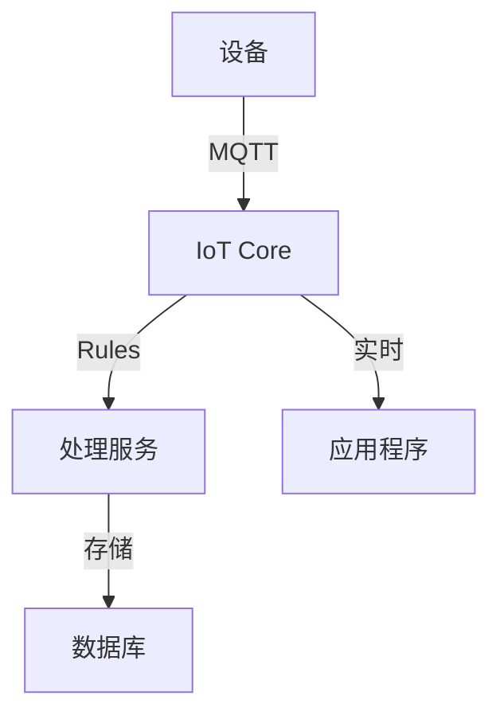

# AWS IoT应用后端架构案例研究

## 目录
- [系统概述](#系统概述)
- [架构设计](#架构设计)
- [设备管理](#设备管理)
- [数据处理](#数据处理)
- [应用集成](#应用集成)
- [安全架构](#安全架构)
- [运维监控](#运维监控)
- [最佳实践](#最佳实践)

## 系统概述

本案例展示了一个基于AWS构建的IoT应用后端解决方案，支持大规模设备接入、实时数据处理、设备管理和应用集成等场景。

### 系统特点

- 海量设备连接
- 实时数据处理
- 设备远程管理
- 安全通信机制
- 灵活扩展能力
- 完整运维体系

## 架构设计

### 整体架构

```yaml
Architecture:
  Connection:
    - IoT Core: 设备连接管理
    - IoT Device Defender: 安全防护
    - IoT Device Management: 设备管理
    
  Processing:
    - IoT Rules Engine: 规则引擎
    - Kinesis: 流处理
    - Lambda: 事件处理
    
  Storage:
    - DynamoDB: 设备状态
    - S3: 历史数据
    - TimeStream: 时序数据
    
  Application:
    - API Gateway: API接口
    - AppSync: 实时同步
    - QuickSight: 数据可视化
```

### 核心组件说明

#### 连接层
- **IoT Core**：设备连接与消息路由
- **Device Defender**：设备安全监控
- **Device Management**：设备生命周期管理

#### 处理层
- **Rules Engine**：消息规则处理
- **Kinesis**：实时数据流处理
- **Lambda**：无服务器计算

#### 存储层
- **DynamoDB**：设备状态存储
- **S3**：历史数据归档
- **TimeStream**：时序数据分析

#### 应用层
- **API Gateway**：RESTful API
- **AppSync**：GraphQL API
- **QuickSight**：数据可视化

## 设备管理

### 设备生命周期

```yaml
DeviceLifecycle:
  Provisioning:
    - 设备注册
    - 证书管理
    - 策略配置
    
  Management:
    - 状态监控
    - 固件更新
    - 远程控制
    
  Maintenance:
    - 健康检查
    - 故障诊断
    - 设备召回
```

### 设备通信模型



### 设备影子服务

```yaml
DeviceShadow:
  Structure:
    - reported: 设备报告状态
    - desired: 期望设备状态
    - metadata: 状态元数据
    
  Operations:
    - GET: 获取影子文档
    - UPDATE: 更新设备状态
    - DELETE: 删除影子文档
    
  Sync:
    - 离线同步
    - 状态冲突解决
    - 版本控制
```

## 数据处理

### 数据采集流程

```yaml
DataCollection:
  Telemetry:
    - Source: 设备传感器
    - Protocol: MQTT
    - Frequency: 可配置
    
  Events:
    - Source: 设备事件
    - Type: 告警/状态变更
    - Priority: 高/中/低
    
  Batch:
    - Source: 历史数据
    - Schedule: 定时上传
    - Format: JSON/Protobuf
```

### 实时处理流程

```yaml
RealTimeProcessing:
  RulesEngine:
    - 消息过滤
    - 数据转换
    - 动作触发
    
  StreamProcessing:
    - 实时分析
    - 异常检测
    - 趋势计算
    
  EventHandling:
    - 事件路由
    - 触发器处理
    - 通知分发
```

### 数据存储策略

```yaml
StorageStrategy:
  HotData:
    - Store: DynamoDB
    - TTL: 7天
    - Access: 高频
    
  WarmData:
    - Store: TimeStream
    - TTL: 30天
    - Access: 分析查询
    
  ColdData:
    - Store: S3
    - Lifecycle: 归档
    - Access: 低频
```

## 应用集成

### API设计

```yaml
APIDesign:
  REST:
    - /devices:
        - GET: 获取设备列表
        - POST: 注册新设备
        
    - /devices/{id}:
        - GET: 获取设备详情
        - PUT: 更新设备配置
        - DELETE: 删除设备
        
    - /devices/{id}/shadow:
        - GET: 获取影子状态
        - POST: 更新影子状态
        
  GraphQL:
    - Query:
        - getDevice
        - listDevices
        - getMetrics
        
    - Mutation:
        - updateDevice
        - controlDevice
        - updateShadow
        
    - Subscription:
        - onDeviceUpdate
        - onStatusChange
        - onAlertTriggered
```

### 实时数据同步

```yaml
RealTimeSync:
  WebSocket:
    - 设备状态推送
    - 实时指标更新
    - 告警通知
    
  MQTT:
    - 设备命令下发
    - 状态变更通知
    - 配置更新推送
```

## 安全架构

### 设备安全

```yaml
DeviceSecurity:
  Authentication:
    - X.509证书
    - IAM认证
    - 自定义认证
    
  Authorization:
    - IoT策略
    - IAM策略
    - 细粒度权限
    
  Communication:
    - TLS加密
    - MQTT安全
    - 消息签名
```

### 数据安全

```yaml
DataSecurity:
  Encryption:
    - 传输加密
    - 存储加密
    - 密钥管理
    
  Access:
    - IAM角色
    - 资源策略
    - 标签控制
    
  Audit:
    - CloudTrail日志
    - CloudWatch日志
    - IoT日志
```

## 运维监控

### 监控指标

```yaml
Monitoring:
  Connectivity:
    - 连接状态
    - 连接时长
    - 协议分布
    
  Performance:
    - 消息吞吐量
    - 处理延迟
    - 错误率
    
  Device:
    - 设备活跃度
    - 电量状态
    - 固件版本
```

### 告警策略

```yaml
Alerts:
  Security:
    - 异常连接
    - 认证失败
    - 策略违规
    
  Operation:
    - 设备离线
    - 消息堆积
    - 处理超时
    
  Business:
    - 异常数据
    - 设备故障
    - 业务中断
```

## 最佳实践

### 架构最佳实践

```yaml
ArchitectureBestPractices:
  Scalability:
    - 设备规模预估
    - 容量规划
    - 自动扩展
    
  Reliability:
    - 故障转移
    - 数据备份
    - 灾难恢复
    
  Performance:
    - 消息优化
    - 存储优化
    - 查询优化
```

### 部署示例

```yaml
# CloudFormation部署模板
Resources:
  IoTPolicy:
    Type: AWS::IoT::Policy
    Properties:
      PolicyName: !Sub ${AWS::StackName}-policy
      PolicyDocument:
        Version: "2012-10-17"
        Statement:
          - Effect: Allow
            Action: 
              - iot:Connect
              - iot:Publish
              - iot:Subscribe
              - iot:Receive
            Resource: "*"

  DeviceTable:
    Type: AWS::DynamoDB::Table
    Properties:
      TableName: !Sub ${AWS::StackName}-devices
      AttributeDefinitions:
        - AttributeName: deviceId
          AttributeType: S
      KeySchema:
        - AttributeName: deviceId
          KeyType: HASH
      BillingMode: PAY_PER_REQUEST
      TimeToLiveSpecification:
        AttributeName: ttl
        Enabled: true

  DeviceDataBucket:
    Type: AWS::S3::Bucket
    Properties:
      BucketName: !Sub ${AWS::StackName}-device-data
      LifecycleConfiguration:
        Rules:
          - Id: ArchiveRule
            Status: Enabled
            Transitions:
              - StorageClass: STANDARD_IA
                TransitionInDays: 90
```

### 扩展建议

1. **功能扩展**
   - 设备群组管理
   - 批量操作能力
   - 高级分析功能
   - 边缘计算集成

2. **架构扩展**
   - 多区域部署
   - 跨账号管理
   - 混合云集成
   - 边缘节点扩展

3. **运维扩展**
   - 自动化运维
   - 智能监控
   - 预测性维护
   - 成本优化 