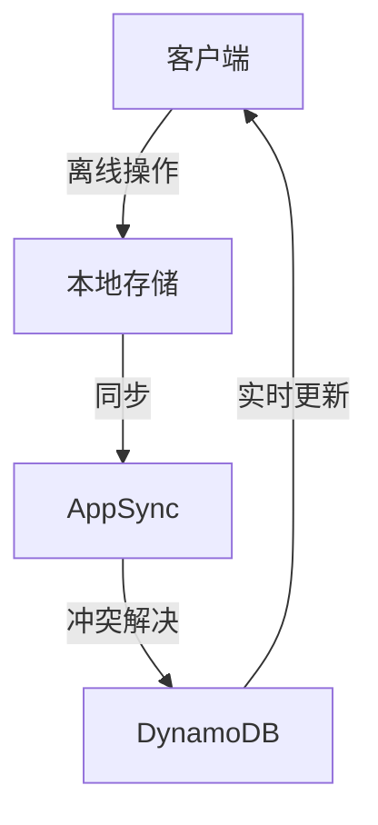

# AWS移动应用后端架构案例研究

## 目录
- [系统概述](#系统概述)
- [架构设计](#架构设计)
- [功能实现](#功能实现)
- [性能优化](#性能优化)
- [安全架构](#安全架构)
- [运维管理](#运维管理)
- [最佳实践](#最佳实践)

## 系统概述

本案例展示了一个基于AWS构建的移动应用后端解决方案，支持用户认证、数据同步、推送通知、离线操作等移动应用常见需求。

### 系统特点

- 无服务器架构
- 自动扩展能力
- 全球内容分发
- 实时数据同步
- 离线数据支持
- 推送通知服务

## 架构设计

### 整体架构

```yaml
Architecture:
  Frontend:
    - CloudFront: CDN加速
    - S3: 静态资源
    - AppSync: GraphQL API
    
  Backend:
    - API Gateway: REST API
    - Lambda: 业务逻辑
    - DynamoDB: 数据存储
    
  RealTime:
    - AppSync: 实时同步
    - WebSocket: 实时通信
    - SNS: 推送服务
    
  Auth:
    - Cognito: 用户认证
    - IAM: 权限控制
    - WAF: 安全防护
```

### 核心组件说明

#### API层
- **API Gateway**：REST API管理
- **AppSync**：GraphQL服务
- **Lambda**：无服务器计算

#### 数据层
- **DynamoDB**：主数据存储
- **ElastiCache**：数据缓存
- **S3**：文件存储

#### 实时层
- **AppSync**：实时数据同步
- **WebSocket**：实时通信
- **SNS**：推送通知

#### 认证层
- **Cognito**：用户池管理
- **IAM**：访问控制
- **KMS**：密钥管理

## 功能实现

### 用户认证流程

```yaml
AuthFlow:
  Registration:
    - 用户注册
    - 邮件验证
    - 手机验证
    - 社交登录
    
  Authentication:
    - 用户登录
    - Token管理
    - 会话控制
    - 多设备登录
    
  Authorization:
    - 角色管理
    - 权限控制
    - 访问策略
```

### 数据同步机制



### API设计

```yaml
APIDesign:
  REST:
    - /users:
        - GET: 获取用户信息
        - POST: 创建用户
        - PUT: 更新用户
        
    - /data:
        - GET: 获取数据
        - POST: 创建数据
        - PUT: 更新数据
        - DELETE: 删除数据
        
  GraphQL:
    Query:
      - getUserProfile
      - getDataList
      - getSettings
      
    Mutation:
      - updateProfile
      - syncData
      - updateSettings
      
    Subscription:
      - onDataChange
      - onNotification
      - onStatusUpdate
```

### 离线支持

```yaml
OfflineSupport:
  DataStorage:
    - SQLite: 本地数据库
    - AsyncStorage: 键值存储
    - FileSystem: 文件缓存
    
  SyncStrategy:
    - 增量同步
    - 冲突解决
    - 后台同步
    
  OfflineOperations:
    - 队列管理
    - 重试机制
    - 状态追踪
```

## 性能优化

### 数据缓存策略

```yaml
CacheStrategy:
  ClientSide:
    - 内存缓存
    - 持久化存储
    - 预加载数据
    
  ServerSide:
    - API缓存
    - 数据库缓存
    - CDN缓存
    
  InvalidationRules:
    - TTL控制
    - 版本控制
    - 手动刷新
```

### API优化

```yaml
APIOptimization:
  ResponseTime:
    - 冷启动优化
    - 连接复用
    - 负载均衡
    
  DataTransfer:
    - 数据压缩
    - 增量更新
    - 批量操作
    
  ErrorHandling:
    - 重试策略
    - 降级处理
    - 超时控制
```

## 安全架构

### 认证授权

```yaml
Security:
  Authentication:
    - JWT令牌
    - OAuth2.0
    - 生物识别
    
  Authorization:
    - RBAC权限
    - 细粒度控制
    - 动态策略
    
  DataProtection:
    - 端到端加密
    - 数据脱敏
    - 安全存储
```

### 安全最佳实践

```yaml
SecurityBestPractices:
  ClientSide:
    - 证书固定
    - 代码混淆
    - 越狱检测
    
  ServerSide:
    - WAF防护
    - DDoS防护
    - 入侵检测
    
  DataSecurity:
    - 传输加密
    - 存储加密
    - 密钥轮换
```

## 运维管理

### 监控指标

```yaml
Monitoring:
  Performance:
    - API延迟
    - 错误率
    - 并发数
    
  Usage:
    - DAU/MAU
    - 接口调用量
    - 存储用量
    
  Business:
    - 用户活跃度
    - 功能使用率
    - 转化率
```

### 日志管理

```yaml
Logging:
  ApplicationLogs:
    - 错误日志
    - 访问日志
    - 性能日志
    
  SecurityLogs:
    - 认证日志
    - 审计日志
    - 安全事件
    
  BusinessLogs:
    - 用户行为
    - 业务事件
    - 统计数据
```

## 最佳实践

### 部署示例

```yaml
# CloudFormation部署模板
Resources:
  UserPool:
    Type: AWS::Cognito::UserPool
    Properties:
      UserPoolName: !Sub ${AWS::StackName}-users
      AutoVerifiedAttributes:
        - email
      Policies:
        PasswordPolicy:
          MinimumLength: 8
          RequireLowercase: true
          RequireNumbers: true
          RequireSymbols: true
          RequireUppercase: true

  ApiGatewayApi:
    Type: AWS::ApiGateway::RestApi
    Properties:
      Name: !Sub ${AWS::StackName}-api
      EndpointConfiguration:
        Types:
          - REGIONAL

  AppSyncApi:
    Type: AWS::AppSync::GraphQLApi
    Properties:
      Name: !Sub ${AWS::StackName}-graphql
      AuthenticationType: AMAZON_COGNITO_USER_POOLS
      UserPoolConfig:
        UserPoolId: !Ref UserPool
        DefaultAction: ALLOW
```

### 扩展建议

1. **功能扩展**
   - 多语言支持
   - 社交集成
   - 高级分析
   - AI/ML功能

2. **性能扩展**
   - 全球化部署
   - 边缘计算
   - 预测式缓存
   - 智能CDN

3. **安全扩展**
   - 高级认证
   - 威胁检测
   - 合规认证
   - 隐私保护

### 开发指南

```yaml
DevelopmentGuidelines:
  MobileSDK:
    - AWS Amplify
    - Native SDK
    - REST客户端
    
  Testing:
    - 单元测试
    - 集成测试
    - 性能测试
    
  Deployment:
    - CI/CD流程
    - 环境管理
    - 版本控制
```

### 成本优化

```yaml
CostOptimization:
  Infrastructure:
    - 自动扩缩容
    - 资源预留
    - 存储优化
    
  Operations:
    - 缓存策略
    - 批处理优化
    - 流量控制
    
  Monitoring:
    - 成本追踪
    - 使用分析
    - 预算控制
``` 