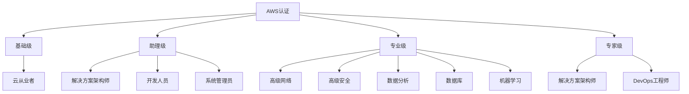
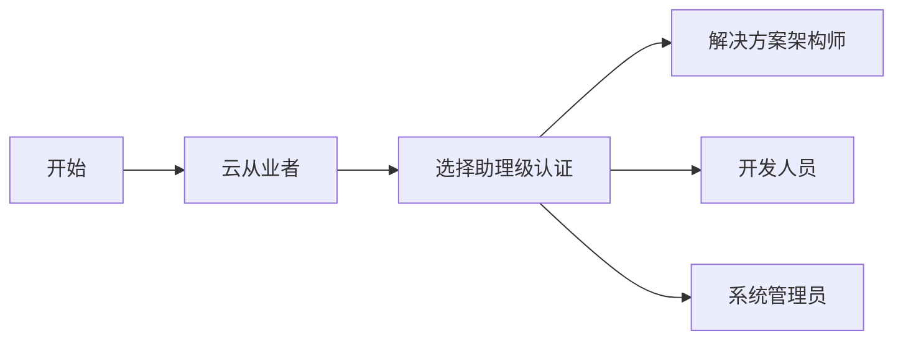
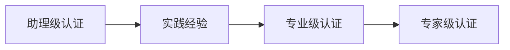

# AWS认证路径指南

本指南提供AWS认证体系的完整概览，帮助您规划认证路径，选择适合的认证，并为考试做好准备。

## 目录

- [认证体系概览](#认证体系概览)
- [认证级别](#认证级别)
- [认证类别](#认证类别)
- [学习路径建议](#学习路径建议)
- [考试准备](#考试准备)
- [认证维护](#认证维护)

## 认证体系概览

AWS认证体系分为四个主要级别，涵盖不同专业领域：

## 认证级别

### 1. 基础级 (Foundational)

- **AWS认证云从业者 (Cloud Practitioner)**
  - 考试代码: CLF-C01
  - 考试时长: 90分钟
  - 题目数量: 65题
  - 考试费用: $100
  - 推荐经验: 6个月AWS基础知识
  - 主要内容:
    - AWS云概念
    - 安全与合规
    - 技术基础
    - 定价与支持

### 2. 助理级 (Associate)

- **解决方案架构师助理级**
  - 考试代码: SAA-C03
  - 考试时长: 130分钟
  - 考试费用: $150
  - 重点领域:
    - 架构设计原则
    - AWS服务选择
    - 迁移规划
    - 成本优化

- **开发人员助理级**
  - 考试代码: DVA-C02
  - 重点领域:
    - 应用程序开发
    - AWS SDK使用
    - 安全实践
    - 部署服务

- **系统管理员助理级**
  - 考试代码: SOA-C02
  - 重点领域:
    - 部署与管理
    - 自动化与优化
    - 监控与故障排除
    - 实施安全控制

### 3. 专业级 (Specialty)

- **高级网络**
- **高级安全**
- **数据分析**
- **数据库**
- **机器学习**

每个专业认证的特点：
- 考试时长: 170分钟
- 考试费用: $300
- 需要深入的专业领域知识
- 推荐具有相关领域实践经验

### 4. 专家级 (Professional)

- **解决方案架构师专家级**
  - 考试代码: SAP-C02
  - 考试时长: 180分钟
  - 考试费用: $300
  - 要求:
    - 2年以上AWS架构设计经验
    - 复杂系统设计能力
    - 多架构模式掌握
    - 成本优化专业知识

- **DevOps工程师专家级**
  - 类似要求和结构
  - 侧重于CICD和自动化

## 学习路径建议

### 1. 新手路径

推荐步骤：
1. 获取云从业者认证
2. 选择职业方向
3. 获取相应助理级认证
4. 积累实践经验
5. 考虑专业级或专家级认证

### 2. 技术专家路径

建议：
- 跳过云从业者直接考助理级
- 专注特定领域深耕
- 获取相关专业级认证
- 最终考取专家级认证

## 考试准备

### 1. 学习资源

- **官方资源**
  - AWS培训和认证门户
  - AWS白皮书
  - AWS文档
  - AWS研讨会

- **实践环境**
  - AWS免费套餐
  - AWS实验室
  - 个人项目实践

- **第三方资源**
  - Udemy课程
  - A Cloud Guru
  - WhizLabs
  - Coursera

### 2. 考试技巧

准备策略：
1. 制定学习计划
2. 使用练习题
3. 参与实验室练习
4. 阅读白皮书
5. 动手实践
6. 模拟考试

考试注意事项：
- 时间管理
- 仔细阅题
- 排除法选择
- 标记不确定题目
- 检查答案

### 3. 实践项目

建议完成的项目类型：
- 无服务器应用
- 容器化应用
- 高可用架构
- 自动化部署
- 监控解决方案

## 认证维护

### 1. 有效期

- 所有认证有效期3年
- 需要定期更新认证
- 可以提前6个月更新

### 2. 更新方式

1. 重新考试
   - 支付全额考试费用
   - 通过最新版本考试

2. 继续教育
   - 参加AWS活动
   - 完成在线课程
   - 获取更高级别认证

### 3. 最佳实践

- 记录认证到期日期
- 提前规划更新时间
- 持续学习新服务
- 保持实践经验
- 参与AWS社区

## 认证价值

### 1. 职业发展

- 提升职业竞争力
- 证明技术能力
- 获得行业认可
- 提高薪资潜力

### 2. 技能提升

- 系统化学习AWS
- 建立最佳实践
- 了解新服务
- 提升问题解决能力

### 3. 组织价值

- 提升团队能力
- 增加AWS合作伙伴级别
- 提高项目成功率
- 优化资源使用

## 参考资源

- [AWS认证官方网站](https://aws.amazon.com/certification/)
- [AWS培训与认证](https://aws.amazon.com/training/)
- [AWS技能建设](https://aws.amazon.com/training/ramp-up-guides/)
- [AWS考试准备](https://aws.amazon.com/certification/certification-prep/) 