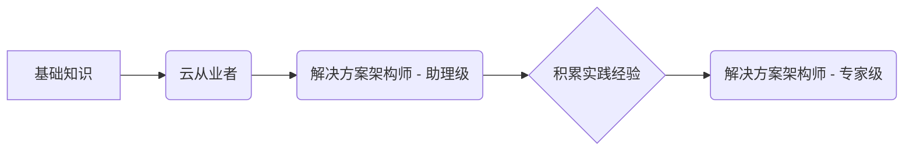

# AWS认证解决方案架构师指南 (Associate vs. Professional)

本指南详细对比AWS认证解决方案架构师的助理级(Associate)和专家级(Professional)认证，帮助您了解两者的区别、考试内容和备考策略。

## 目录

- [认证路径概览](#认证路径概览)
- [解决方案架构师 - 助理级 (SAA-C03)](#解决方案架构师---助理级-saa-c03)
- [解决方案架构师 - 专家级 (SAP-C02)](#解决方案架构师---专家级-sap-c02)
- [Associate vs. Professional 对比](#associate-vs-professional-对比)
- [从Associate到Professional的进阶之路](#从associate到professional的进阶之路)
- [备考资源](#备考资源)

## 认证路径概览

解决方案架构师认证路径是AWS认证体系中的核心，主要考察设计和部署高可用、可扩展、经济高效的AWS解决方案的能力。

## 解决方案架构师 - 助理级 (SAA-C03)

### 认证概述

此认证适合具有一年以上AWS实践经验的解决方案架构师。它验证了设计和部署安全、可靠的AWS应用程序的能力。

### 考试详情

- **考试代码:** SAA-C03
- **考试时长:** 130分钟
- **题目数量:** 65道选择题或多选题
- **考试费用:** $150
- **通过分数:** 720 / 1000

### 考试领域

| 领域 | 权重 |
| --- | --- |
| 设计弹性架构 | 30% |
| 设计高性能架构 | 28% |
| 设计安全应用程序和架构 | 24% |
| 设计成本优化架构 | 18% |

### 主要考察点

- 核心AWS服务（VPC, EC2, S3, RDS, IAM）的理解和应用
- 设计高可用和容错架构（ELB, Auto Scaling, Route 53）
- 解耦应用程序（SQS, SNS）
- 选择合适的数据库服务
- 实施基本的安全和合规控制

## 解决方案架构师 - 专家级 (SAP-C02)

### 认证概述

此认证面向具有两年以上AWS解决方案设计和部署经验的资深架构师。它验证了在AWS上管理和操作复杂解决方案的能力。

### 考试详情

- **考试代码:** SAP-C02
- **考试时长:** 180分钟
- **题目数量:** 75道选择题或多选题
- **考试费用:** $300
- **通过分数:** 750 / 1000

### 考试领域

| 领域 | 权重 |
| --- | --- |
| 为复杂组织设计解决方案 | 26% |
| 为新解决方案设计 | 29% |
| 持续改进现有解决方案 | 25% |
| 加速工作负载迁移和现代化 | 20% |

### 主要考察点

- **多账户策略:** AWS Organizations, Service Control Policies (SCPs)
- **高级网络:** Direct Connect, VPN, Transit Gateway, VPC Endpoints
- **迁移和现代化:** 数据库迁移服务(DMS), 应用迁移服务(MGN)
- **成本管理:** 成本和使用情况报告(CUR), 预算和预留实例
- **安全与合规:** 高级IAM功能, AWS WAF, Shield, KMS
- **业务连续性:** 跨区域灾难恢复策略

## Associate vs. Professional 对比

| 特性 | 解决方案架构师 - 助理级 (SAA-C03) | 解决方案架构师 - 专家级 (SAP-C02) |
| --- | --- | --- |
| **目标人群** | 1年以上经验的架构师 | 2年以上经验的资深架构师 |
| **考察范围** | 核心服务和基础架构设计 | 复杂、多账户、混合云架构 |
| **问题复杂度** | 场景较直接，通常涉及单一服务或小规模集成 | 场景复杂，涉及多服务集成、多账户管理和混合环境 |
| **选项迷惑性** | 选项差异较明显 | 选项非常相似，需深入理解服务细节和权衡 |
| **所需知识** | "What is it?" 和 "How does it work?" | "Why choose this?" 和 "What's the trade-off?" |
| **核心技能** | 设计和部署 | 评估、优化和迁移 |

## 从Associate到Professional的进阶之路

1.  **巩固助理级知识:** 确保你对SAA-C03涵盖的所有核心服务有深入的理解。
2.  **积累实践经验:** 这是最关键的一步。在实际项目中应用你的知识，特别是在网络、安全和多账户管理方面。
3.  **学习专家级主题:**
    -   深入研究AWS Organizations, Direct Connect, Transit Gateway。
    -   掌握数据库和应用程序的迁移策略。
    -   学习高级成本管理和优化技术。
4.  **阅读AWS白皮书:**
    -   《AWS Well-Architected Framework》
    -   《AWS Security Best Practices》
    -   《AWS Migration Whitepaper》
5.  **大量练习:** 完成高质量的模拟题，分析每个选项的正确与错误之处。

## 备考资源

### 助理级 (SAA-C03)

- **官方资源:**
  - [AWS Certified Solutions Architect – Associate Official Study Guide](https://aws.amazon.com/certification/certification-prep/solutions-architect-associate/)
  - AWS Skill Builder 课程
- **第三方课程:**
  - Adrian Cantrill - `learn.cantrill.io`
  - Stephane Maarek - Udemy
- **练习题:**
  - Jon Bonso - Tutorials Dojo

### 专家级 (SAP-C02)

- **官方资源:**
  - [AWS Certified Solutions Architect – Professional Official Study Guide](https://aws.amazon.com/certification/certification-prep/solutions-architect-professional/)
  - AWS Ramp-Up Guide: Architect
- **第三方课程:**
  - Adrian Cantrill - `learn.cantrill.io` (非常推荐)
  - Stephane Maarek - Udemy
- **练习题:**
  - Jon Bonso - Tutorials Dojo
- **必读:**
  - AWS re:Invent 技术演讲
  - AWS 官方博客和文档

## 总结

助理级认证是验证您是否掌握AWS核心服务和基础架构设计能力的绝佳方式。而专家级认证则更进一步，检验您在复杂、大规模环境中设计、优化和迁移解决方案的专业能力。从助理级到专家级的过程，是从“知道是什么”到“知道为什么”的转变，需要大量的实践和深入思考。 