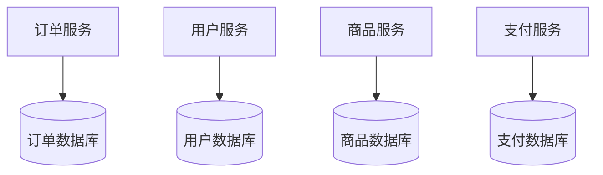
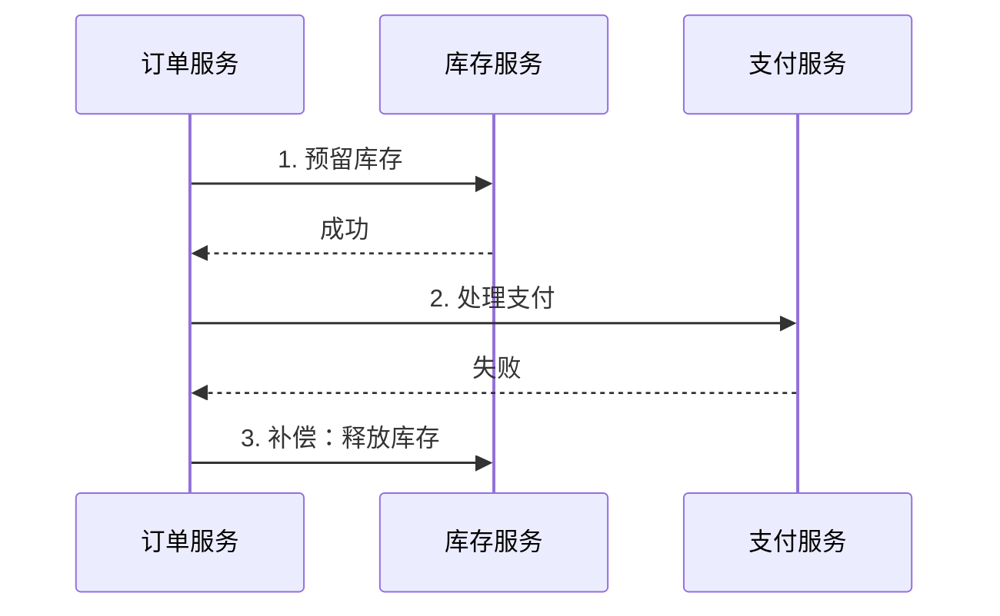
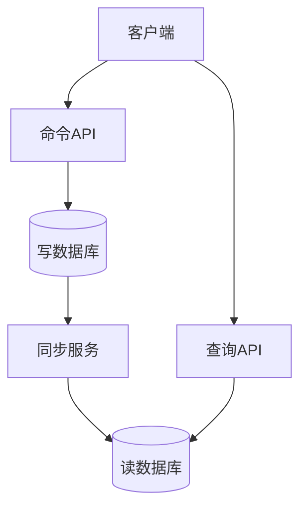

# 微服务数据管理

> [!NOTE]
> 本文档详细介绍了微服务架构中的数据管理策略，包括数据一致性模式、查询模式、数据存储选择、事务管理等关键主题。

## 目录

- [概述](#概述)
- [数据存储策略](#数据存储策略)
- [数据一致性模式](#数据一致性模式)
- [查询模式](#查询模式)
- [事务管理](#事务管理)
- [数据同步与复制](#数据同步与复制)
- [缓存策略](#缓存策略)
- [数据安全](#数据安全)
- [性能优化](#性能优化)
- [最佳实践](#最佳实践)
- [常见挑战与解决方案](#常见挑战与解决方案)
- [实现案例](#实现案例)
- [参考资源](#参考资源)

## 概述

在微服务架构中，数据管理是一个核心挑战。每个微服务都应该拥有自己的数据存储，并且负责管理自己的数据。这种方式带来了一系列挑战，包括数据一致性、分布式事务、跨服务查询等问题。本文档将详细介绍这些挑战的解决方案和最佳实践。

### 数据管理的核心原则

1. **数据自治**：每个微服务独立管理自己的数据
2. **接口自治**：通过API而不是共享数据库进行数据访问
3. **技术多样性**：根据业务需求选择合适的数据存储技术
4. **数据隔离**：避免跨服务的直接数据访问
5. **最终一致性**：在服务间采用最终一致性模型

## 数据存储策略

### 数据库每服务模式

这是微服务架构中最推荐的数据存储模式，每个服务拥有自己的数据库。



#### 优势
- 服务间完全解耦
- 独立扩展和维护
- 技术选择灵活性
- 故障隔离

#### 挑战
- 分布式事务复杂性
- 数据一致性维护
- 跨服务查询性能
- 运维复杂性增加

### 多数据库技术选择

根据不同的业务需求选择合适的数据库类型：

| 数据库类型 | 适用场景 | 示例 |
|-----------|---------|------|
| 关系型数据库 | 事务性操作、复杂查询 | MySQL, PostgreSQL |
| 文档数据库 | 灵活的数据结构、快速开发 | MongoDB, CouchDB |
| 键值存储 | 高性能缓存、会话管理 | Redis, DynamoDB |
| 搜索引擎 | 全文搜索、日志分析 | Elasticsearch |
| 图数据库 | 关系网络分析 | Neo4j |

## 数据一致性模式

### SAGA模式

SAGA模式是处理分布式事务的主要方式，通过一系列本地事务来维护数据一致性。



#### 实现方式

1. **编排式SAGA**

```java
@Service
public class OrderSaga {
    @Autowired
    private OrderService orderService;
    @Autowired
    private InventoryService inventoryService;
    @Autowired
    private PaymentService paymentService;
    
    @Transactional
    public void createOrder(Order order) {
        try {
            // 创建订单
            orderService.create(order);
            
            // 预留库存
            inventoryService.reserve(order.getItems());
            
            // 处理支付
            paymentService.process(order.getPayment());
        } catch (Exception e) {
            // 执行补偿操作
            compensate(order);
            throw e;
        }
    }
    
    private void compensate(Order order) {
        // 补偿逻辑
        inventoryService.release(order.getItems());
        orderService.cancel(order.getId());
    }
}
```

2. **编排式SAGA**

```java
@Service
public class OrderService {
    @Autowired
    private EventBus eventBus;
    
    public void createOrder(Order order) {
        // 发布订单创建事件
        eventBus.publish(new OrderCreatedEvent(order));
    }
    
    @EventHandler
    public void onInventoryReserved(InventoryReservedEvent event) {
        // 处理库存预留成功事件
        processPayment(event.getOrder());
    }
    
    @EventHandler
    public void onPaymentProcessed(PaymentProcessedEvent event) {
        // 处理支付成功事件
        completeOrder(event.getOrder());
    }
    
    @EventHandler
    public void onFailure(FailureEvent event) {
        // 处理失败事件，执行补偿
        compensate(event.getOrder());
    }
}
```

### 事件溯源模式

事件溯源通过存储实体的状态变更事件来维护数据一致性。

```java
@Entity
public class Order {
    private List<Event> events = new ArrayList<>();
    
    public void apply(CreateOrderEvent event) {
        this.status = OrderStatus.CREATED;
        this.items = event.getItems();
        events.add(event);
    }
    
    public void apply(PaymentProcessedEvent event) {
        this.status = OrderStatus.PAID;
        this.paymentDetails = event.getPaymentDetails();
        events.add(event);
    }
    
    public void rebuild() {
        events.forEach(this::apply);
    }
}
```

## 查询模式

### CQRS（命令查询职责分离）

将读操作和写操作分离，使用不同的模型和存储。



#### 实现示例

```java
// 命令模型
@Service
public class OrderCommandService {
    @Autowired
    private OrderRepository repository;
    @Autowired
    private EventBus eventBus;
    
    @Transactional
    public void createOrder(CreateOrderCommand cmd) {
        Order order = new Order(cmd);
        repository.save(order);
        eventBus.publish(new OrderCreatedEvent(order));
    }
}

// 查询模型
@Service
public class OrderQueryService {
    @Autowired
    private OrderReadRepository readRepository;
    
    public OrderDTO getOrder(String orderId) {
        return readRepository.findById(orderId)
            .map(this::toDTO)
            .orElseThrow(() -> new OrderNotFoundException(orderId));
    }
    
    public List<OrderDTO> findOrdersByUser(String userId) {
        return readRepository.findByUserId(userId)
            .stream()
            .map(this::toDTO)
            .collect(Collectors.toList());
    }
}
```

### API组合模式

通过API网关或BFF层组合多个服务的数据。

```java
@RestController
@RequestMapping("/api/orders")
public class OrderApiController {
    @Autowired
    private OrderService orderService;
    @Autowired
    private UserService userService;
    @Autowired
    private ProductService productService;
    
    @GetMapping("/{orderId}")
    public OrderDetailDTO getOrderDetail(@PathVariable String orderId) {
        // 获取订单基本信息
        Order order = orderService.getOrder(orderId);
        
        // 获取用户信息
        User user = userService.getUser(order.getUserId());
        
        // 获取商品信息
        List<Product> products = productService.getProducts(
            order.getItems().stream()
                .map(OrderItem::getProductId)
                .collect(Collectors.toList())
        );
        
        // 组合数据
        return new OrderDetailDTO(order, user, products);
    }
}
```

## 数据同步与复制

### 事件驱动同步

使用事件驱动架构实现服务间的数据同步。

```java
@Service
public class OrderEventHandler {
    @Autowired
    private OrderReadModelRepository repository;
    
    @EventListener
    public void onOrderCreated(OrderCreatedEvent event) {
        OrderReadModel readModel = new OrderReadModel(event.getOrder());
        repository.save(readModel);
    }
    
    @EventListener
    public void onOrderUpdated(OrderUpdatedEvent event) {
        OrderReadModel readModel = repository.findById(event.getOrderId())
            .orElseThrow(() -> new OrderNotFoundException(event.getOrderId()));
        readModel.update(event);
        repository.save(readModel);
    }
}
```

### 变更数据捕获(CDC)

使用CDC工具实现数据库级别的同步。

```yaml
CDC配置示例:
  source:
    type: mysql
    database: orders
    table: orders
  
  destination:
    type: elasticsearch
    index: orders
    
  mapping:
    fields:
      - source: id
        destination: orderId
      - source: status
        destination: orderStatus
      - source: created_at
        destination: createdAt
```

## 缓存策略

### 多级缓存

实现多级缓存以提高查询性能。

```java
@Service
public class ProductCacheService {
    @Autowired
    private RedisTemplate redisTemplate;
    @Autowired
    private CaffeineCacheManager localCache;
    @Autowired
    private ProductRepository repository;
    
    public Product getProduct(String productId) {
        // 检查本地缓存
        Product product = localCache.get(productId);
        if (product != null) {
            return product;
        }
        
        // 检查分布式缓存
        product = redisTemplate.opsForValue().get(productId);
        if (product != null) {
            localCache.put(productId, product);
            return product;
        }
        
        // 从数据库获取
        product = repository.findById(productId)
            .orElseThrow(() -> new ProductNotFoundException(productId));
            
        // 更新缓存
        redisTemplate.opsForValue().set(productId, product);
        localCache.put(productId, product);
        
        return product;
    }
}
```

### 缓存一致性

实现缓存更新策略以维护一致性。

```java
@Service
public class ProductCacheManager {
    @Autowired
    private RedisTemplate redisTemplate;
    @Autowired
    private EventBus eventBus;
    
    @EventListener
    public void onProductUpdated(ProductUpdatedEvent event) {
        // 删除缓存
        redisTemplate.delete(event.getProductId());
        
        // 发布缓存失效事件
        eventBus.publish(new CacheInvalidationEvent(
            "product", event.getProductId()
        ));
    }
}
```

## 数据安全

### 数据加密

实现数据加密以保护敏感信息。

```java
@Component
public class DataEncryption {
    @Value("${encryption.key}")
    private String encryptionKey;
    
    public String encrypt(String data) {
        // 加密实现
    }
    
    public String decrypt(String encryptedData) {
        // 解密实现
    }
}

@Entity
public class User {
    @Convert(converter = EncryptedStringConverter.class)
    private String creditCardNumber;
    
    @Convert(converter = EncryptedStringConverter.class)
    private String socialSecurityNumber;
}
```

### 数据访问控制

实现细粒度的数据访问控制。

```java
@Service
public class DataAccessService {
    @Autowired
    private SecurityContext securityContext;
    
    @PreAuthorize("hasRole('ADMIN') or @dataAccessEvaluator.canAccess(#userId)")
    public UserData getUserData(String userId) {
        // 数据访问逻辑
    }
}
```

## 最佳实践

1. **选择合适的数据存储**
   - 根据业务需求选择数据库类型
   - 考虑性能、可扩展性和维护性
   - 评估团队技术能力

2. **实现有效的数据分区**
   - 基于业务边界划分数据
   - 避免跨服务的数据依赖
   - 使用异步通信保持数据一致性

3. **优化查询性能**
   - 实现合适的缓存策略
   - 使用正确的索引
   - 优化查询模式

4. **确保数据安全**
   - 实现数据加密
   - 实施访问控制
   - 进行安全审计

5. **管理数据一致性**
   - 选择适当的一致性模型
   - 实现可靠的事务管理
   - 处理并发访问

## 参考资源

- [微服务架构模式](https://microservices.io/patterns/index.html)
- [CQRS模式](https://martinfowler.com/bliki/CQRS.html)
- [事件溯源](https://martinfowler.com/eaaDev/EventSourcing.html)
- [数据一致性模式](https://docs.microsoft.com/azure/architecture/patterns/category/data-management)
- [分布式系统模式](https://martinfowler.com/articles/patterns-of-distributed-systems/) 