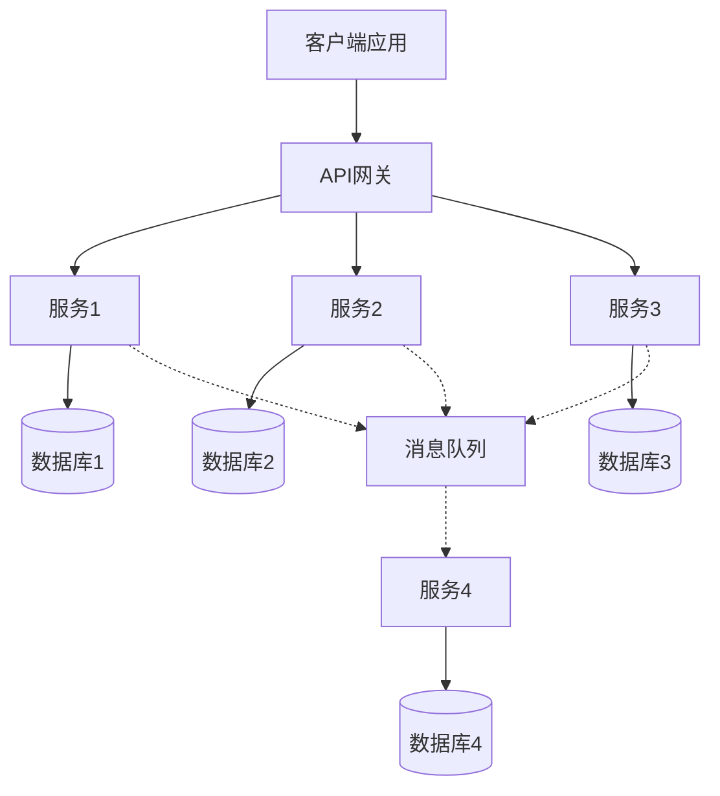
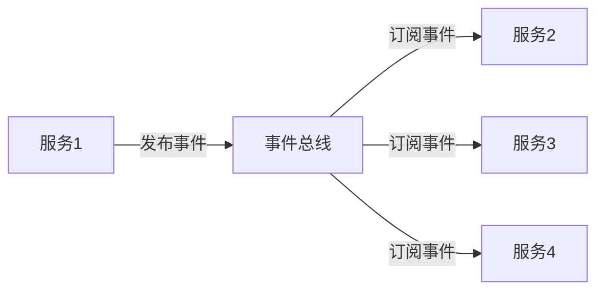
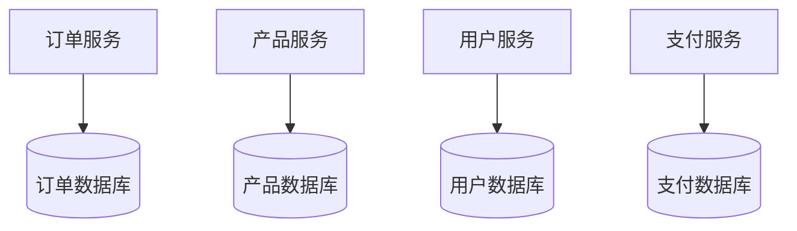
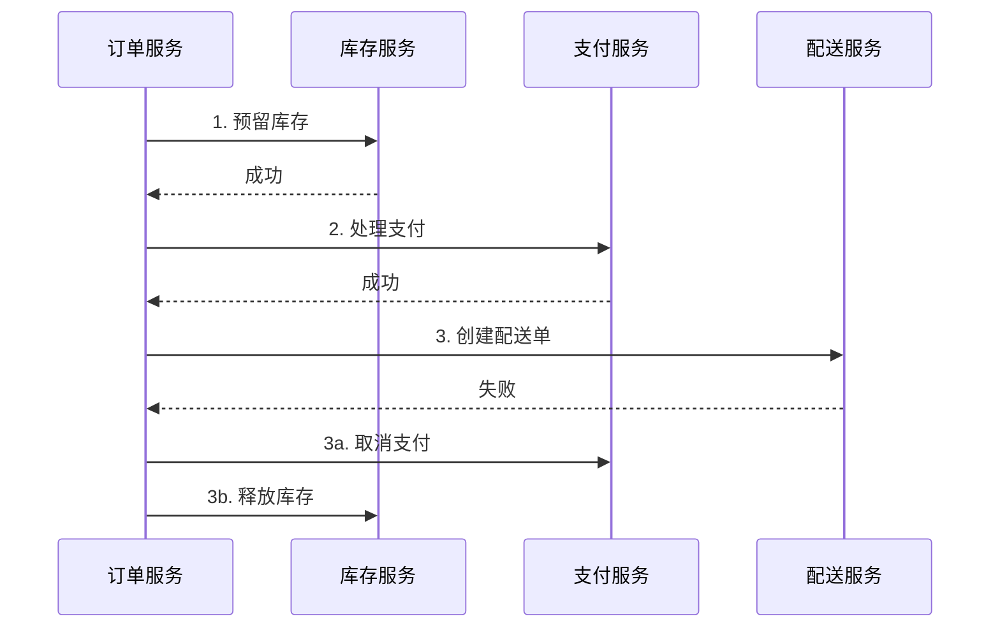
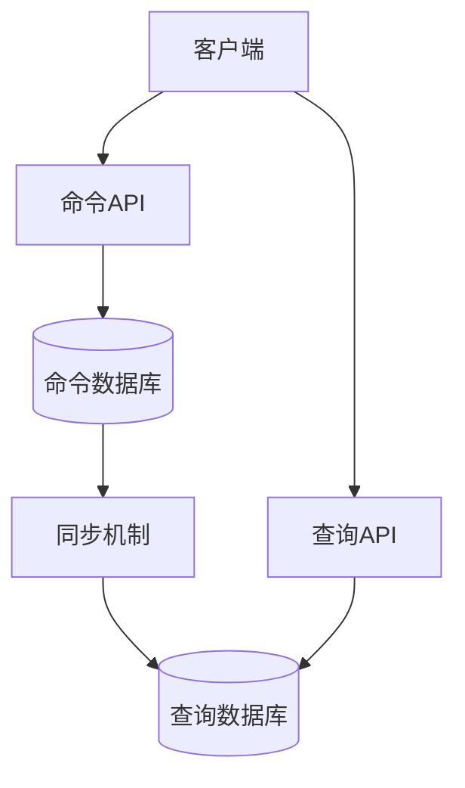
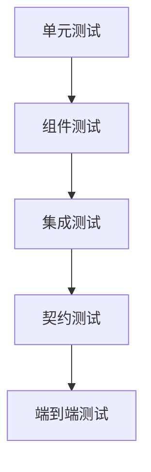
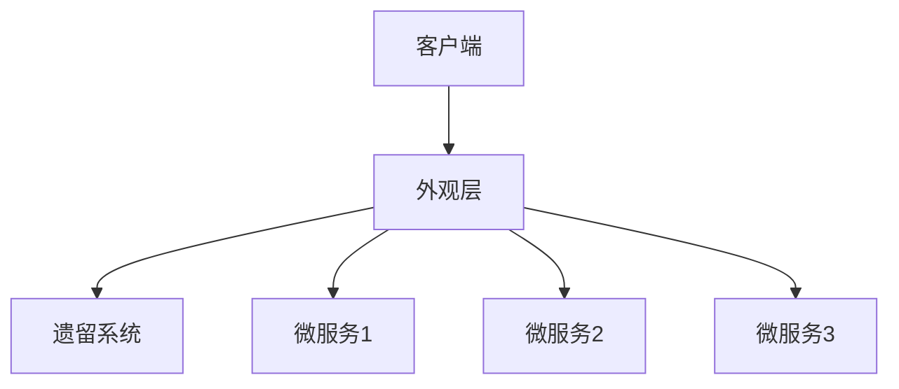

# 微服务架构设计与实现指南

> [!NOTE]
> 本文档提供了微服务架构的设计原则和实现方法，包括架构模式、服务设计、通信策略和部署实践，适用于各种云平台和技术栈。

## 目录

- [概述](#概述)
- [微服务架构基础](#微服务架构基础)
- [服务设计原则](#服务设计原则)
- [服务通信模式](#服务通信模式)
- [数据管理策略](#数据管理策略)
- [微服务安全](#微服务安全)
- [部署与运维](#部署与运维)
- [微服务测试策略](#微服务测试策略)
- [迁移到微服务](#迁移到微服务)
- [常见挑战与解决方案](#常见挑战与解决方案)
- [微服务实现案例](#微服务实现案例)
- [工具与框架](#工具与框架)
- [参考资源](#参考资源)

## 概述

微服务架构是一种将应用程序设计为一系列松耦合、可独立部署的小型服务的方法。每个服务运行在自己的进程中，通过轻量级机制（通常是HTTP/REST API或消息队列）进行通信。这种架构模式与传统的单体应用相比，提供了更好的可扩展性、灵活性和技术栈多样性。

### 微服务架构的优势

- **技术异构性**：不同服务可以使用不同的技术栈
- **弹性**：服务故障被隔离，不会导致整个系统崩溃
- **可扩展性**：可以独立扩展各个服务
- **部署灵活性**：支持独立部署和持续交付
- **组织对齐**：支持小型、自治的团队
- **可组合性**：服务可以以不同方式组合和重用

### 微服务架构的挑战

- **分布式系统复杂性**：网络延迟、容错、一致性等问题
- **运维复杂性**：需要管理多个服务和部署
- **测试复杂性**：需要测试服务间交互
- **数据一致性**：跨服务事务和数据同步
- **服务治理**：版本控制、服务发现、配置管理等

## 微服务架构基础

### 架构原则

1. **单一职责**：每个服务应专注于单一业务能力
2. **自治**：服务应能独立开发、测试、部署和运行
3. **弹性设计**：系统应能容忍服务故障
4. **去中心化**：避免集中式服务和数据管理
5. **持续交付**：支持频繁、自动化的服务部署
6. **可观测性**：提供监控、日志和分布式跟踪

### 微服务架构模式



#### 基本组件

- **API网关**：统一入口点，路由请求到后端服务
- **服务实例**：独立的业务功能单元
- **服务注册与发现**：定位和访问服务实例
- **消息队列**：异步通信和事件处理
- **数据存储**：每个服务的专用数据存储
- **配置服务**：集中管理配置信息
- **监控与跟踪**：系统健康和性能监控

## 服务设计原则

### 服务边界定义

#### 领域驱动设计(DDD)方法

领域驱动设计提供了一套方法来识别和定义服务边界：

1. **识别限界上下文**：找出业务领域中相对独立的部分
2. **定义领域模型**：为每个上下文创建模型
3. **确定上下文映射**：定义上下文间的关系
4. **提取共享内核**：识别多个上下文共享的概念

#### 服务粒度

确定适当的服务粒度是微服务设计的关键挑战：

- **过大**：失去微服务的优势，变成"小型单体"
- **过小**：导致过多服务，增加管理复杂性

评估服务粒度的因素：
- 业务功能的内聚性
- 团队结构和规模
- 数据模型的独立性
- 变更频率和部署需求

### 服务接口设计

#### API设计原则

- **简单性**：保持API简单直观
- **一致性**：在所有服务中保持一致的设计风格
- **向后兼容**：避免破坏性变更
- **版本控制**：明确的版本策略
- **文档化**：全面的API文档

#### API风格

1. **REST**：基于HTTP的资源导向API
   ```
   GET /customers/123
   POST /orders
   PUT /products/456
   DELETE /cart/789
   ```

2. **GraphQL**：客户端指定需要的数据
   ```graphql
   query {
     customer(id: "123") {
       name
       orders {
         id
         products {
           name
           price
         }
       }
     }
   }
   ```

3. **gRPC**：高性能RPC框架
   ```protobuf
   service OrderService {
     rpc CreateOrder(CreateOrderRequest) returns (Order);
     rpc GetOrder(GetOrderRequest) returns (Order);
     rpc UpdateOrder(UpdateOrderRequest) returns (Order);
     rpc DeleteOrder(DeleteOrderRequest) returns (Empty);
   }
   ```

### 服务实现策略

#### 技术栈选择

为每个微服务选择适当的技术栈，考虑因素包括：

- 团队技能和经验
- 服务的性能需求
- 开发效率和生产力
- 社区支持和生态系统
- 运维复杂性

#### 代码组织

- **模块化设计**：清晰的内部模块边界
- **领域模型**：反映业务概念的核心模型
- **分层架构**：API层、业务逻辑层、数据访问层
- **依赖注入**：松耦合组件设计
- **配置外部化**：环境特定配置分离

## 服务通信模式

### 同步通信

#### REST API

- **优点**：简单、广泛支持、易于理解
- **缺点**：紧耦合、可能引入延迟
- **适用场景**：用户驱动的交互、查询操作

实现示例：
```java
@RestController
@RequestMapping("/orders")
public class OrderController {
    @Autowired
    private OrderService orderService;
    
    @GetMapping("/{id}")
    public Order getOrder(@PathVariable String id) {
        return orderService.findById(id);
    }
    
    @PostMapping
    public Order createOrder(@RequestBody OrderRequest request) {
        return orderService.createOrder(request);
    }
}
```

#### gRPC

- **优点**：高性能、强类型、代码生成
- **缺点**：需要额外的代理支持HTTP/JSON
- **适用场景**：服务间高频通信、低延迟要求

实现示例（proto定义）：
```protobuf
syntax = "proto3";

service ProductService {
  rpc GetProduct(ProductRequest) returns (Product);
  rpc SearchProducts(SearchRequest) returns (stream Product);
}

message ProductRequest {
  string product_id = 1;
}

message Product {
  string id = 1;
  string name = 2;
  double price = 3;
  int32 stock = 4;
}

message SearchRequest {
  string query = 1;
  int32 page_size = 2;
  int32 page_number = 3;
}
```

### 异步通信

#### 消息队列

- **优点**：松耦合、缓冲负载峰值、提高可用性
- **缺点**：增加系统复杂性、难以调试
- **适用场景**：事件通知、后台处理、工作流

实现示例（使用RabbitMQ）：
```java
// 发布者
@Service
public class OrderEventPublisher {
    @Autowired
    private RabbitTemplate rabbitTemplate;
    
    public void publishOrderCreated(Order order) {
        rabbitTemplate.convertAndSend("order-exchange", "order.created", order);
    }
}

// 消费者
@Service
public class OrderEventConsumer {
    @RabbitListener(queues = "order-created-queue")
    public void handleOrderCreated(Order order) {
        // 处理订单创建事件
    }
}
```

#### 事件驱动架构

- **优点**：高度解耦、可扩展性强
- **缺点**：事件顺序和一致性挑战
- **适用场景**：复杂业务流程、领域事件通知



### 服务发现

#### 客户端发现

- **实现**：客户端直接查询服务注册表
- **优点**：减少网络跳转，客户端可以实现智能负载均衡
- **缺点**：客户端与服务注册耦合，增加复杂性

#### 服务端发现

- **实现**：通过负载均衡器或API网关路由请求
- **优点**：客户端无需了解服务发现细节
- **缺点**：额外的网络跳转，可能成为瓶颈

#### 服务注册表

常用服务注册与发现工具：
- **Consul**：服务网格解决方案
- **Eureka**：Netflix开源的服务发现工具
- **etcd**：分布式键值存储
- **ZooKeeper**：分布式协调服务

## 数据管理策略

### 数据库架构模式

#### 数据库per服务

- **模式**：每个微服务拥有自己的数据库
- **优点**：完全解耦，独立技术选择，独立扩展
- **缺点**：分布式事务复杂，数据重复
- **实现**：物理分离数据库或逻辑分离模式



#### 共享数据库

- **模式**：多个服务共享一个数据库
- **优点**：简化事务，避免数据重复
- **缺点**：紧耦合，违反微服务自治原则
- **适用场景**：紧密相关的服务，过渡阶段

### 数据一致性

#### 事务管理

1. **分布式事务**
   - 两阶段提交（2PC）
   - SAGA模式
   - TCC（Try-Confirm-Cancel）

2. **最终一致性**
   - 基于事件的一致性
   - 补偿事务
   - 定期数据同步

#### SAGA模式实现



### 数据查询模式

#### CQRS模式

命令查询责任分离(CQRS)将系统操作分为命令(写)和查询(读)两部分：

- **命令端**：处理状态变更，优化写操作
- **查询端**：提供数据视图，优化读操作
- **同步机制**：事件总线，定期同步，实时复制



#### API组合模式

- **实现**：API网关或BFF层组合多个服务数据
- **优点**：客户端获取所需的精确数据
- **缺点**：可能增加延迟，网关层复杂性
- **适用场景**：需要来自多个微服务的数据

## 微服务安全

### 认证与授权

#### 认证策略

1. **集中式认证**
   - OAuth 2.0 / OpenID Connect
   - JWT (JSON Web Tokens)
   - 单点登录(SSO)

2. **服务间认证**
   - 服务账户
   - 客户端证书
   - API密钥

#### 授权模型

- **基于角色的访问控制(RBAC)**
- **基于属性的访问控制(ABAC)**
- **策略即代码**

### API安全

- **输入验证**：防止注入攻击
- **速率限制**：防止DoS攻击
- **请求加密**：保护敏感数据
- **审计日志**：记录安全相关事件

### 密钥管理

- **密钥存储**：专用密钥管理服务
- **密钥轮换**：定期更新密钥
- **最小权限**：限制密钥访问范围
- **密钥加密**：保护存储的密钥

## 部署与运维

### 容器化与编排

#### Docker容器化

- **镜像设计**：轻量级、安全、可复制
- **多阶段构建**：优化镜像大小
- **基础镜像选择**：安全性与大小平衡
- **配置管理**：环境变量、配置文件

Dockerfile示例：
```dockerfile
# 构建阶段
FROM maven:3.8-openjdk-11 AS build
WORKDIR /app
COPY pom.xml .
COPY src ./src
RUN mvn package -DskipTests

# 运行阶段
FROM openjdk:11-jre-slim
WORKDIR /app
COPY --from=build /app/target/*.jar app.jar
EXPOSE 8080
ENTRYPOINT ["java", "-jar", "app.jar"]
```

#### 容器编排

1. **Kubernetes**
   - Pod设计
   - 服务发现与负载均衡
   - 配置管理
   - 自动扩展

2. **Docker Swarm**
   - 服务定义
   - 网络配置
   - 密钥管理
   - 滚动更新

### 持续集成与部署(CI/CD)

#### CI/CD流水线

1. **代码提交阶段**
   - 代码质量检查
   - 单元测试
   - 安全扫描

2. **构建阶段**
   - 编译代码
   - 构建容器镜像
   - 镜像漏洞扫描

3. **测试阶段**
   - 集成测试
   - 契约测试
   - 性能测试

4. **部署阶段**
   - 环境配置
   - 部署策略
   - 健康检查

#### 部署策略

- **蓝绿部署**：两个相同环境间切换
- **金丝雀发布**：逐步推出新版本
- **滚动更新**：逐个替换服务实例
- **A/B测试**：针对不同用户组测试功能

### 配置管理

- **外部化配置**：与代码分离
- **环境特定配置**：开发、测试、生产
- **运行时配置更新**：无需重启服务
- **配置版本控制**：追踪配置变更

## 微服务测试策略

### 测试类型



1. **单元测试**：测试单个函数或类
2. **组件测试**：测试单个服务
3. **集成测试**：测试多个服务交互
4. **契约测试**：验证服务间接口契约
5. **端到端测试**：测试整个系统流程

### 测试自动化

- **测试驱动开发(TDD)**
- **行为驱动开发(BDD)**
- **测试金字塔策略**
- **测试覆盖率目标**

### 测试环境管理

- **环境即代码**：可复制的测试环境
- **服务虚拟化**：模拟依赖服务
- **测试数据管理**：准备和清理测试数据
- **并行测试执行**：加速测试流程

## 迁移到微服务

### 迁移策略

#### 逐步迁移

1. **识别服务边界**：分析现有单体应用
2. **提取共享库**：分离可重用组件
3. **实现新功能为微服务**：增量添加
4. **分解现有功能**：逐步拆分单体

#### 绞杀者模式(Strangler Pattern)



1. **创建外观层**：拦截请求
2. **逐步实现微服务**：替换功能
3. **重定向流量**：从单体到微服务
4. **移除旧代码**：完成迁移后

### 迁移挑战

- **数据迁移**：拆分数据库，保持一致性
- **事务管理**：从本地事务到分布式事务
- **服务依赖**：识别和管理依赖关系
- **团队重组**：从功能团队到产品团队

## 常见挑战与解决方案

### 分布式系统挑战

#### 网络可靠性

- **挑战**：网络故障、延迟、分区
- **解决方案**：
  - 断路器模式
  - 重试策略
  - 超时控制
  - 异步通信

#### 数据一致性

- **挑战**：分布式事务、数据同步
- **解决方案**：
  - SAGA模式
  - 事件溯源
  - 最终一致性
  - 补偿事务

#### 服务协调

- **挑战**：服务发现、负载均衡
- **解决方案**：
  - 服务注册表
  - 客户端/服务端发现
  - 健康检查
  - 智能路由

### 运维挑战

#### 监控与可观测性

- **挑战**：分布式跟踪、根因分析
- **解决方案**：
  - 集中式日志管理
  - 分布式追踪
  - 指标聚合
  - 服务依赖图

#### 故障处理

- **挑战**：故障检测、隔离和恢复
- **解决方案**：
  - 健康检查
  - 自动恢复
  - 舱壁模式
  - 混沌工程

## 微服务实现案例

### 电子商务平台

#### 服务拆分

- **产品服务**：产品目录和库存管理
- **订单服务**：订单处理和状态跟踪
- **支付服务**：支付处理和集成
- **用户服务**：用户账户和身份认证
- **推荐服务**：个性化产品推荐
- **搜索服务**：产品搜索和过滤

#### 技术实现

- **服务实现**：Spring Boot, Node.js, Python
- **数据存储**：PostgreSQL, MongoDB, Redis
- **消息队列**：Kafka, RabbitMQ
- **API网关**：Kong, Spring Cloud Gateway
- **服务网格**：Istio, Linkerd
- **容器编排**：Kubernetes

### 金融服务平台

#### 服务拆分

- **账户服务**：账户管理和余额
- **交易服务**：处理金融交易
- **认证服务**：多因素认证
- **报告服务**：财务报告和分析
- **通知服务**：用户通知和警报
- **合规服务**：审计和合规检查

#### 技术实现

- **服务实现**：Java, .NET Core
- **数据存储**：SQL Server, Oracle, Redis
- **消息队列**：Kafka
- **事件溯源**：EventStore, Axon
- **安全**：OAuth 2.0, OIDC, HSM
- **监控**：Prometheus, Grafana, ELK Stack

## 工具与框架

### 开发框架

#### Java生态系统

- **Spring Boot/Cloud**：微服务开发框架
- **Quarkus**：Kubernetes原生Java框架
- **Micronaut**：轻量级微服务框架
- **Helidon**：Oracle的微服务框架

#### JavaScript/TypeScript生态系统

- **Node.js/Express**：轻量级服务框架
- **NestJS**：企业级Node.js框架
- **Fastify**：高性能Node.js框架
- **Moleculer**：微服务框架

#### .NET生态系统

- **.NET Core**：跨平台框架
- **Steeltoe**：微服务工具集
- **Dapr**：分布式应用运行时
- **Orleans**：虚拟Actor框架

### 基础设施工具

- **Docker/Kubernetes**：容器化和编排
- **Istio/Linkerd**：服务网格
- **Consul/Eureka**：服务发现
- **Jenkins/GitLab CI**：CI/CD管道
- **Prometheus/Grafana**：监控和可视化
- **ELK/EFK Stack**：日志管理
- **Jaeger/Zipkin**：分布式追踪

## 参考资源

- [微服务模式](https://microservices.io/patterns/index.html)
- [Building Microservices](https://www.oreilly.com/library/view/building-microservices-2nd/9781492034018/)
- [Domain-Driven Design](https://domainlanguage.com/ddd/)
- [The Twelve-Factor App](https://12factor.net/)
- [Microservices AntiPatterns and Pitfalls](https://www.oreilly.com/library/view/microservices-antipatterns-and/9781492042716/)

---

> 本文档将持续更新，欢迎提供反馈和建议。 