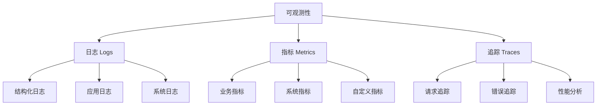
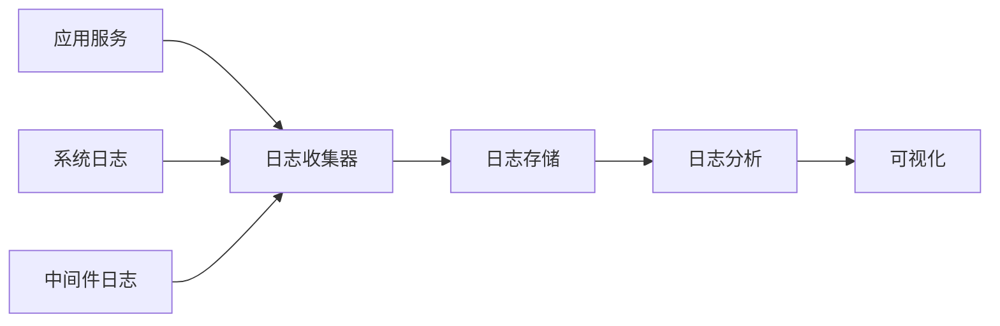

# 微服务监控与可观测性指南

> [!NOTE]
> 本文档详细介绍了微服务架构中的监控和可观测性实现方案，包括日志管理、指标监控、分布式追踪等关键方面。

## 目录

- [可观测性基础](#可观测性基础)
- [日志管理](#日志管理)
- [指标监控](#指标监控)
- [分布式追踪](#分布式追踪)
- [告警与通知](#告警与通知)
- [可视化与仪表板](#可视化与仪表板)
- [最佳实践](#最佳实践)
- [常见挑战](#常见挑战)

## 可观测性基础

### 三大支柱



### 关键目标

1. **问题检测**
   - 及早发现异常
   - 快速定位问题
   - 预防性监控
   - 性能瓶颈识别

2. **系统优化**
   - 性能调优
   - 资源优化
   - 成本控制
   - 容量规划

3. **业务洞察**
   - 用户行为分析
   - 业务指标跟踪
   - 趋势分析
   - 决策支持

## 日志管理

### 日志架构



### 日志实现

1. **日志收集**
   ```yaml
   收集策略:
     应用日志:
       - 业务日志
       - 错误日志
       - 访问日志
       - 调试日志
     
     系统日志:
       - 容器日志
       - 主机日志
       - 中间件日志
       - 网络日志
   ```

2. **日志格式化**
   ```json
   {
     "timestamp": "2024-03-21T10:00:00Z",
     "level": "INFO",
     "service": "order-service",
     "traceId": "abc123",
     "message": "Order processed successfully",
     "metadata": {
       "orderId": "12345",
       "userId": "user789",
       "amount": 99.99
     }
   }
   ```

3. **日志存储**
   - 集中式存储
   - 数据压缩
   - 生命周期管理
   - 访问控制

### 日志分析

1. **查询与检索**
   - 全文搜索
   - 结构化查询
   - 聚合分析
   - 模式识别

2. **异常检测**
   - 错误模式识别
   - 异常行为检测
   - 性能问题诊断
   - 安全事件分析

## 指标监控

### 指标类型

1. **系统指标**
   ```yaml
   基础指标:
     资源使用:
       - CPU使用率
       - 内存使用率
       - 磁盘IO
       - 网络流量
     
     容器指标:
       - 容器状态
       - 资源限制
       - 重启次数
       - 运行时间
   ```

2. **应用指标**
   ```yaml
   性能指标:
     - 响应时间
     - 请求速率
     - 错误率
     - 并发数
   
   业务指标:
     - 交易量
     - 用户活跃度
     - 转化率
     - 业务成功率
   ```

### 指标收集

1. **收集方式**
   - Push模式：应用主动推送
   - Pull模式：监控系统拉取
   - 代理收集：通过Agent收集

2. **数据处理**
   - 数据聚合
   - 降采样
   - 标签化
   - 持久化

### 指标分析

1. **趋势分析**
   - 历史数据对比
   - 趋势预测
   - 季节性分析
   - 容量规划

2. **相关性分析**
   - 指标关联
   - 根因分析
   - 影响评估
   - 性能优化

## 分布式追踪

### 追踪实现

1. **链路追踪**
   ```mermaid
   sequenceDiagram
       participant 用户
       participant API网关
       participant 订单服务
       participant 支付服务
       participant 库存服务
       
       用户->>API网关: 创建订单
       API网关->>订单服务: 处理订单
       订单服务->>支付服务: 支付请求
       订单服务->>库存服务: 库存检查
       库存服务-->>订单服务: 库存确认
       支付服务-->>订单服务: 支付确认
       订单服务-->>API网关: 订单完成
       API网关-->>用户: 返回结果
   ```

2. **追踪上下文**
   ```yaml
   上下文信息:
     - TraceID: 全局唯一追踪标识
     - SpanID: 当前操作标识
     - ParentSpanID: 父操作标识
     - 时间戳: 操作发生时间
     - 标签: 自定义标签信息
   ```

### 采样策略

1. **动态采样**
   - 基于流量的采样
   - 基于错误的采样
   - 基于延迟的采样
   - 自适应采样

2. **采样配置**
   ```json
   {
     "defaultSampler": {
       "type": "probabilistic",
       "param": 0.1
     },
     "errorSampler": {
       "type": "rateLimiting",
       "param": 100
     }
   }
   ```

## 告警与通知

### 告警配置

1. **告警规则**
   ```yaml
   规则定义:
     高CPU使用率:
       指标: cpu_usage
       阈值: 80%
       持续时间: 5分钟
       严重级别: 警告
     
     高错误率:
       指标: error_rate
       阈值: 5%
       持续时间: 2分钟
       严重级别: 严重
   ```

2. **告警级别**
   - 信息：提示性信息
   - 警告：需要关注
   - 严重：需要立即处理
   - 紧急：影响业务运行

### 通知渠道

1. **通知方式**
   - 电子邮件
   - 短信
   - 企业即时通讯
   - 语音通知

2. **升级策略**
   ```yaml
   升级流程:
     第一级:
       - 通知当值工程师
       - 等待时间: 15分钟
     
     第二级:
       - 通知团队负责人
       - 等待时间: 10分钟
     
     第三级:
       - 通知系统管理员
       - 等待时间: 5分钟
   ```

## 可视化与仪表板

### 仪表板设计

1. **系统概览**
   - 服务健康状态
   - 关键性能指标
   - 资源使用情况
   - 告警概况

2. **服务详情**
   - 服务依赖关系
   - 调用链分析
   - 错误分布
   - 性能趋势

### 可视化组件

1. **图表类型**
   - 时间序列图
   - 热力图
   - 依赖关系图
   - 状态面板

2. **交互功能**
   - 时间范围选择
   - 下钻分析
   - 过滤条件
   - 数据导出

## 最佳实践

### 监控策略

1. **分层监控**
   ```yaml
   监控层次:
     基础设施层:
       - 硬件资源
       - 网络连接
       - 系统服务
     
     容器层:
       - 容器状态
       - 编排系统
       - 服务网格
     
     应用层:
       - 业务逻辑
       - 性能指标
       - 用户体验
   ```

2. **监控覆盖**
   - 全栈监控
   - 端到端追踪
   - 业务监控
   - 用户体验监控

### 实施建议

1. **工具选择**
   - 开源vs商业
   - 易用性考虑
   - 扩展性需求
   - 成本效益

2. **团队协作**
   - 明确责任
   - 建立流程
   - 知识共享
   - 持续改进

## 常见挑战

### 技术挑战

1. **数据量大**
   - 数据采样
   - 存储优化
   - 查询性能
   - 成本控制

2. **系统复杂**
   - 服务依赖
   - 问题定位
   - 性能影响
   - 维护成本

### 解决方案

1. **架构优化**
   - 合理分层
   - 数据压缩
   - 缓存策略
   - 分布式存储

2. **流程优化**
   - 自动化运维
   - 标准化流程
   - 持续集成
   - 反馈优化 