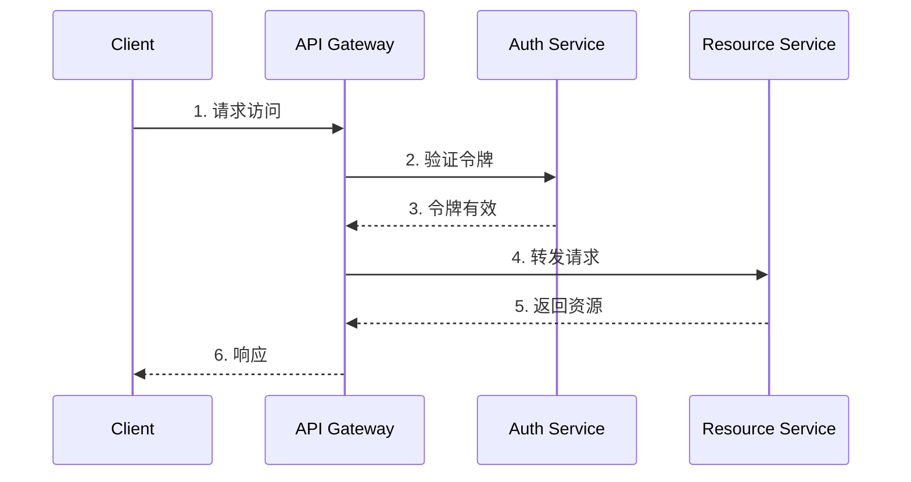

# 微服务安全实现指南

> [!NOTE]
> 本文档详细介绍了微服务架构中的安全实现方案，包括身份认证、授权管理、API安全、数据保护等关键方面。

## 目录

- [认证与身份管理](#认证与身份管理)
- [授权与访问控制](#授权与访问控制)
- [API安全](#api安全)
- [数据安全](#数据安全)
- [服务间通信安全](#服务间通信安全)
- [安全监控与审计](#安全监控与审计)
- [最佳实践](#最佳实践)
- [常见安全挑战](#常见安全挑战)

## 认证与身份管理

### 集中式认证

#### OAuth 2.0 / OpenID Connect实现



1. **认证服务配置**
   - 实现OAuth 2.0授权服务器
   - 支持多种授权类型（授权码、客户端凭证等）
   - 集成OpenID Connect提供身份信息
   - 实现令牌管理和刷新机制

2. **JWT令牌实现**
   - 使用非对称加密签名令牌
   - 包含必要的身份和权限声明
   - 设置合理的令牌过期时间
   - 实现令牌撤销机制

3. **单点登录(SSO)**
   - 统一的身份提供者
   - 跨服务共享会话
   - 统一的登出机制
   - 会话状态同步

### 服务间认证

1. **服务账户**
   - 为每个服务分配唯一身份
   - 使用服务账户令牌
   - 实现自动令牌轮换
   - 审计服务账户使用

2. **mTLS认证**
   - 配置双向TLS认证
   - 证书管理和轮换
   - 证书吊销处理
   - 证书生命周期管理

## 授权与访问控制

### 基于角色的访问控制(RBAC)

1. **角色设计**
   ```yaml
   roles:
     admin:
       - 完全访问权限
       - 系统配置权限
       - 用户管理权限
     operator:
       - 操作权限
       - 监控权限
       - 有限配置权限
     viewer:
       - 只读权限
       - 基本监控权限
   ```

2. **权限管理**
   - 细粒度权限定义
   - 角色继承关系
   - 动态权限分配
   - 权限审计机制

### 基于属性的访问控制(ABAC)

1. **属性类型**
   - 用户属性（部门、职位等）
   - 资源属性（类型、敏感度等）
   - 环境属性（时间、位置等）
   - 操作属性（读、写、删除等）

2. **策略定义**
   ```json
   {
     "effect": "allow",
     "conditions": {
       "user.department": "finance",
       "resource.type": "financial_report",
       "action": "read",
       "time": "business_hours"
     }
   }
   ```

## API安全

### 输入验证与清理

1. **请求验证**
   - 参数类型验证
   - 范围和格式验证
   - 业务规则验证
   - 防注入处理

2. **数据清理**
   - HTML转义
   - SQL注入防护
   - 跨站脚本(XSS)防护
   - 特殊字符处理

### 流量控制

1. **速率限制**
   ```yaml
   限制策略:
     - 用户级限制
     - IP级限制
     - 服务级限制
     - 全局限制
   
   实现方式:
     - 令牌桶算法
     - 滑动窗口
     - 计数器
   ```

2. **流量整形**
   - 请求排队
   - 负载均衡
   - 流量调度
   - 服务降级

### API网关安全

1. **请求过滤**
   - 异常检测
   - 黑名单过滤
   - 特征识别
   - 行为分析

2. **响应处理**
   - 敏感信息过滤
   - 响应格式化
   - 错误处理
   - 状态码规范

## 数据安全

### 数据加密

1. **传输加密**
   - TLS 1.3配置
   - 证书管理
   - 密码套件选择
   - 前向安全性

2. **存储加密**
   - 数据库加密
   - 文件系统加密
   - 密钥管理
   - 加密算法选择

### 敏感数据处理

1. **数据分类**
   ```yaml
   分类级别:
     高敏感度:
       - 个人身份信息
       - 金融数据
       - 医疗记录
     中敏感度:
       - 业务数据
       - 配置信息
       - 操作日志
     低敏感度:
       - 公开信息
       - 统计数据
   ```

2. **数据脱敏**
   - 掩码处理
   - 数据替换
   - 格式保留加密
   - 动态脱敏

## 服务间通信安全

### 服务网格安全

1. **流量加密**
   - Sidecar代理
   - mTLS配置
   - 证书管理
   - 密钥分发

2. **访问控制**
   - 服务级别策略
   - 流量策略
   - 故障处理
   - 熔断机制

### 消息队列安全

1. **消息加密**
   - 端到端加密
   - 消息签名
   - 完整性校验
   - 防重放保护

2. **访问控制**
   - 主题级别权限
   - 发布者认证
   - 订阅者认证
   - 消息过滤

## 安全监控与审计

### 日志管理

1. **日志收集**
   ```yaml
   日志类型:
     - 访问日志
     - 认证日志
     - 操作日志
     - 错误日志
   
   收集策略:
     - 实时收集
     - 集中存储
     - 日志分级
     - 保留策略
   ```

2. **日志分析**
   - 异常检测
   - 模式识别
   - 关联分析
   - 趋势分析

### 安全审计

1. **审计追踪**
   - 操作记录
   - 变更追踪
   - 访问历史
   - 合规检查

2. **报告生成**
   - 安全报告
   - 合规报告
   - 事件报告
   - 趋势报告

## 最佳实践

### 安全开发生命周期

1. **设计阶段**
   - 威胁建模
   - 安全架构设计
   - 风险评估
   - 安全需求定义

2. **实现阶段**
   - 安全编码规范
   - 代码审查
   - 安全测试
   - 漏洞扫描

3. **部署阶段**
   - 安全配置
   - 环境隔离
   - 密钥管理
   - 访问控制

4. **运维阶段**
   - 持续监控
   - 事件响应
   - 定期评估
   - 安全更新

### 安全配置清单

```yaml
基础配置:
  - 最小权限原则
  - 强密码策略
  - 加密传输
  - 访问控制

服务配置:
  - 服务隔离
  - 端口限制
  - 资源限制
  - 日志配置

监控配置:
  - 异常检测
  - 告警阈值
  - 审计策略
  - 响应流程
```

## 常见安全挑战

### 分布式系统安全

1. **边界保护**
   - 网络分段
   - 访问控制
   - 流量监控
   - 入侵检测

2. **一致性保证**
   - 分布式会话
   - 状态同步
   - 数据一致性
   - 并发控制

### 微服务特有挑战

1. **服务粒度**
   - 安全边界定义
   - 职责划分
   - 接口设计
   - 依赖管理

2. **动态性**
   - 服务发现
   - 配置管理
   - 扩缩容安全
   - 版本管理

### 解决方案

1. **技术选择**
   - 成熟的安全框架
   - 标准协议
   - 最佳实践
   - 社区支持

2. **架构优化**
   - 安全分层
   - 职责分离
   - 故障隔离
   - 可观测性 