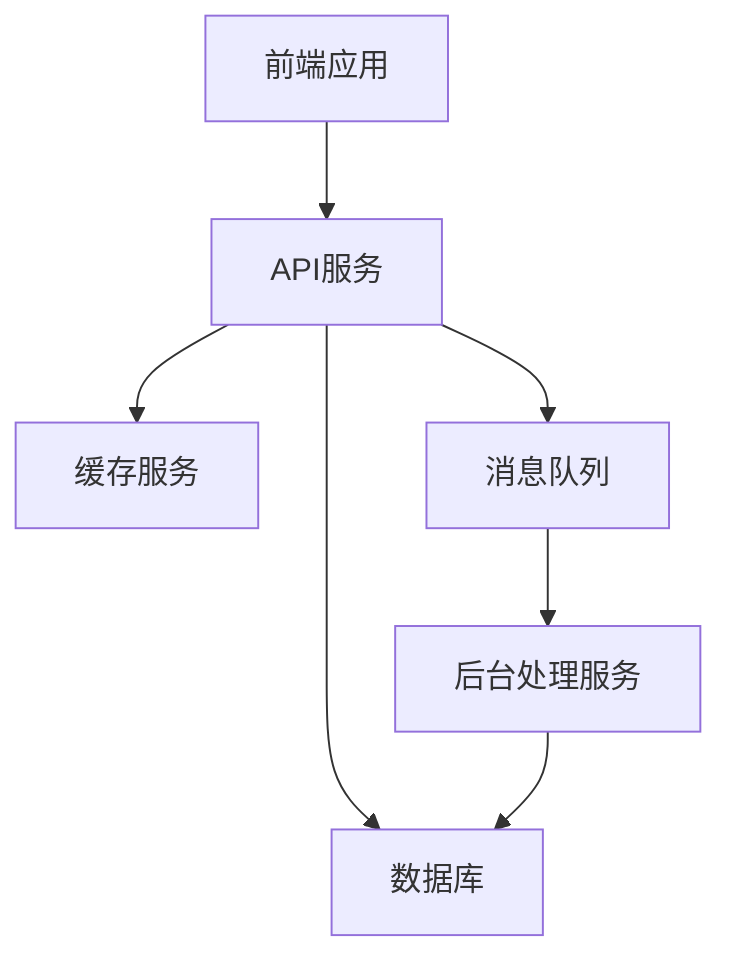
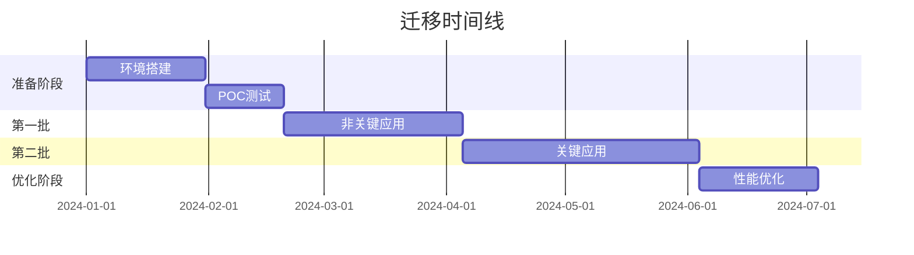

# 大规模云迁移指南

本指南详细介绍了企业级工作负载的大规模云迁移策略和实施方法。

## 目录
- [迁移准备](#迁移准备)
- [迁移评估](#迁移评估)
- [迁移规划](#迁移规划)
- [迁移执行](#迁移执行)
- [迁移后优化](#迁移后优化)

## 迁移准备

### 1. 建立迁移团队
- **核心迁移团队**
  - 项目经理
  - 技术架构师
  - 云平台专家
  - 安全专家
  - 网络工程师
  - 数据库专家
  - 应用开发团队代表

- **支持团队**
  - 业务分析师
  - 质量保证团队
  - 运维团队
  - 合规团队

### 2. 制定治理框架
- 迁移决策流程
- 风险管理策略
- 变更管理流程
- 沟通管理计划
- 质量控制标准

### 3. 建立基础设施
- 网络连接（专线/VPN）
- 身份认证系统
- 监控系统
- 备份系统
- 灾备方案

## 迁移评估

### 1. 应用程序清单
- 应用名称和功能
- 技术栈详情
- 依赖关系图
- 数据流向图
- 业务重要性评级
- 合规要求

### 2. 工作负载分析
- CPU使用率
- 内存消耗
- 存储需求
- 网络流量
- 峰值负载
- 性能基准

### 3. 依赖关系映射


### 4. 风险评估
- 业务中断风险
- 数据丢失风险
- 性能下降风险
- 安全合规风险
- 成本超支风险

## 迁移规划

### 1. 迁移策略选择
- **重新托管 (Rehost)**
  - 适用场景：传统应用，时间紧迫
  - 实施方法：使用自动化工具进行迁移
  - 注意事项：性能优化留待后期

- **重新平台化 (Replatform)**
  - 适用场景：需要部分现代化的应用
  - 实施方法：更换特定组件，如数据库迁移到云服务
  - 注意事项：确保兼容性

- **重构 (Refactor)**
  - 适用场景：核心业务应用，需要云原生能力
  - 实施方法：采用微服务架构，使用容器化
  - 注意事项：需要较长开发周期

### 2. 分批迁移计划


### 3. 资源规划
- 计算资源配置
- 存储容量规划
- 网络带宽需求
- 安全组策略
- 成本预算

## 迁移执行

### 1. 环境准备清单
```yaml
网络配置:
  - VPC设置
  - 子网划分
  - 路由表配置
  - 安全组规则
  - 负载均衡器

身份认证:
  - IAM策略
  - 角色定义
  - 访问控制

监控告警:
  - 性能指标
  - 日志收集
  - 告警规则
  - 应急响应
```

### 2. 数据迁移策略
- **大容量数据**
  - 使用物理传输设备
  - 分批次传输
  - 增量同步机制

- **实时数据**
  - 双写机制
  - CDC（变更数据捕获）
  - 实时同步工具

### 3. 切换流程
```yaml
准备阶段:
  - 完成数据同步
  - 验证数据一致性
  - 准备回滚方案
  - 通知相关方

切换步骤:
  - 停止写入源系统
  - 完成最终数据同步
  - 更新DNS/负载均衡
  - 启动目标系统
  - 验证系统功能

验证清单:
  - 核心功能测试
  - 性能监控
  - 数据一致性检查
  - 日志审查
```

## 迁移后优化

### 1. 性能优化
- 资源使用监控
- 自动扩缩容配置
- 缓存策略优化
- 数据库性能调优

### 2. 成本优化
- 资源使用分析
- 预留实例规划
- 自动关停闲置资源
- 存储分层策略

### 3. 运维优化
- 自动化运维流程
- 监控告警优化
- 备份策略调整
- 灾备方案验证

### 4. 安全优化
- 安全基线检查
- 漏洞扫描
- 访问控制审查
- 加密策略优化

## 最佳实践建议

1. **规划阶段**
   - 进行充分的依赖性分析
   - 制定详细的回滚计划
   - 建立清晰的成功标准

2. **执行阶段**
   - 采用自动化工具
   - 执行充分的测试
   - 保持频繁沟通

3. **优化阶段**
   - 持续监控性能
   - 定期评估成本
   - 及时响应反馈

## 常见挑战及解决方案

### 1. 技术挑战
- **问题**：遗留系统兼容性
- **解决方案**：使用中间件或适配层

### 2. 组织挑战
- **问题**：技能差距
- **解决方案**：培训计划和外部专家支持

### 3. 业务挑战
- **问题**：业务连续性
- **解决方案**：分阶段迁移和充分测试

## 附录

### 工具清单
- 迁移评估工具
- 自动化迁移工具
- 监控工具
- 测试工具

### 模板文档
- 迁移计划模板
- 风险评估模板
- 回滚计划模板
- 测试用例模板 