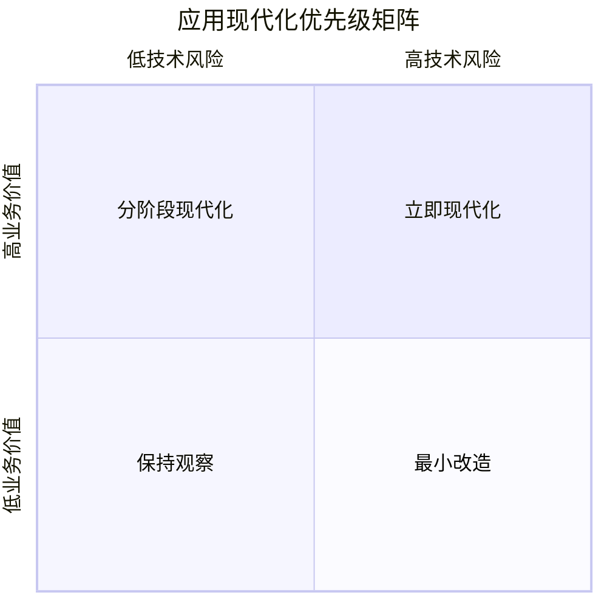
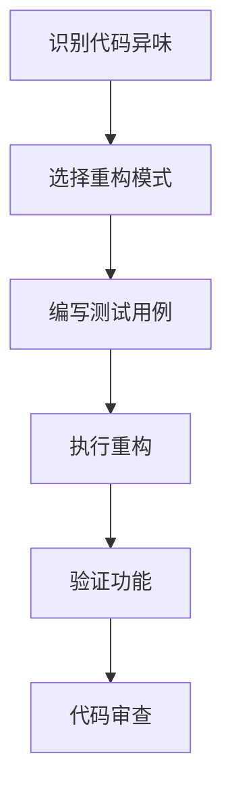
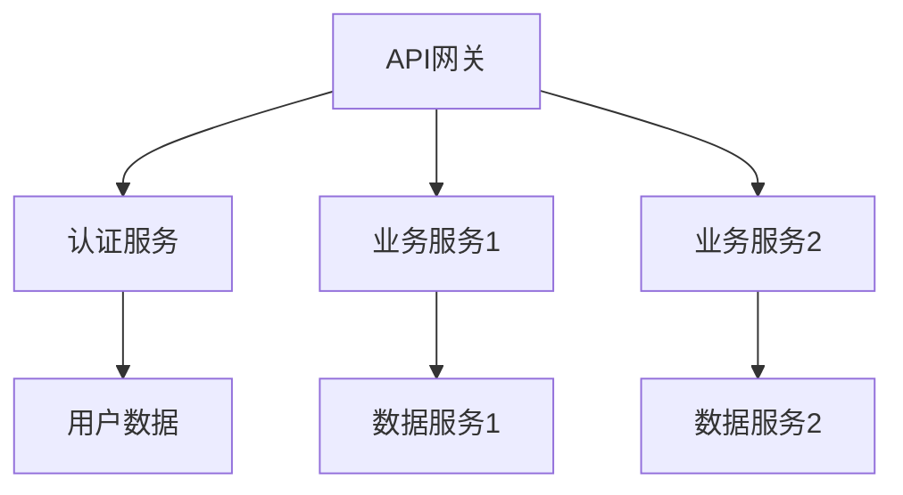

# 应用现代化指南

本指南详细介绍了遗留应用现代化的策略、方法论和最佳实践，帮助企业实现应用的现代化转型。

## 目录
- [评估与规划](#评估与规划)
- [现代化策略](#现代化策略)
- [技术现代化](#技术现代化)
- [架构现代化](#架构现代化)
- [实施流程](#实施流程)
- [最佳实践](#最佳实践)

## 评估与规划

### 1. 应用评估框架

#### 业务维度评估
- 业务价值评估
- 用户满意度分析
- 运营成本分析
- 市场竞争力分析
- 未来业务需求预测

#### 技术维度评估
```yaml
代码质量:
  - 代码复杂度
  - 技术债务
  - 测试覆盖率
  - 文档完整性
  
维护性:
  - 变更频率
  - 问题修复时间
  - 依赖更新难度
  
性能指标:
  - 响应时间
  - 并发处理能力
  - 资源利用率
  
安全合规:
  - 安全漏洞
  - 合规要求
  - 数据保护能力
```

### 2. 现代化优先级矩阵



## 现代化策略

### 1. 策略选择框架

#### 重构（Refactoring）
- **适用场景**
  - 核心业务系统
  - 长期维护的应用
  - 高业务价值应用
- **实施方法**
  - 渐进式重构
  - 测试驱动开发
  - 代码质量改进

#### 重写（Rewrite）
- **适用场景**
  - 技术严重过时
  - 维护成本过高
  - 扩展性受限
- **实施方法**
  - 领域驱动设计
  - 微服务架构
  - 现代技术栈

#### 封装（Encapsulation）
- **适用场景**
  - 稳定的遗留系统
  - 风险敏感应用
  - 临时过渡方案
- **实施方法**
  - API封装层
  - 数据访问层
  - 服务适配器

### 2. 技术栈现代化

```yaml
前端技术:
  - 现代框架:
      - React/Vue/Angular
      - 响应式设计
      - 渐进式Web应用
  
后端技术:
  - 微服务框架:
      - Spring Cloud
      - Node.js
      - Go微服务
  
数据层:
  - 现代数据库:
      - 分布式数据库
      - NoSQL解决方案
      - 缓存技术
  
部署技术:
  - 容器化:
      - Docker
      - Kubernetes
  - CI/CD:
      - 自动化部署
      - 持续集成
```

## 技术现代化

### 1. 代码现代化

#### 代码重构模式


#### 常见重构模式
- 提取方法
- 移动方法
- 替换条件逻辑
- 简化数据结构
- 引入设计模式

### 2. 数据现代化

#### 数据迁移策略
```yaml
数据评估:
  - 数据量评估
  - 数据质量分析
  - 数据依赖关系

迁移方案:
  - 增量迁移
  - 实时同步
  - 数据验证

数据治理:
  - 数据标准化
  - 主数据管理
  - 数据安全
```

## 架构现代化

### 1. 微服务转型

#### 服务拆分策略
- 领域驱动设计
- 单一职责原则
- 服务粒度控制
- 数据一致性考虑

#### 微服务架构图


### 2. 云原生改造

#### 云原生特性
- 容器化部署
- 服务网格
- 自动扩缩容
- 健康检查
- 配置中心
- 服务发现

#### 实施路径
```yaml
基础设施准备:
  - 容器平台搭建
  - 服务网格部署
  - 监控系统部署

应用改造:
  - 容器化改造
  - 配置外部化
  - 健康检查接入
  - 日志规范化

运维体系:
  - 自动化部署
  - 监控告警
  - 灾备方案
```

## 实施流程

### 1. 试点项目实施

#### 实施步骤
1. 选择合适的试点项目
2. 组建专门的现代化团队
3. 制定详细的实施计划
4. 建立评估指标体系
5. 执行现代化改造
6. 总结经验教训

#### 风险控制
- 功能验证
- 性能基准测试
- 回滚方案
- 分批次上线

### 2. 规模化推广

#### 推广策略
```yaml
培训体系:
  - 技术培训
  - 最佳实践分享
  - 案例研究

标准规范:
  - 架构规范
  - 开发规范
  - 测试规范
  - 部署规范

支持体系:
  - 技术支持团队
  - 工具平台
  - 文档中心
```

## 最佳实践

### 1. 技术实践

#### 开发实践
- 测试驱动开发
- 持续集成/部署
- 代码审查
- 自动化测试
- 性能测试

#### 架构实践
- 领域驱动设计
- 事件驱动架构
- 微服务设计模式
- 安全性设计

### 2. 管理实践

#### 项目管理
- 敏捷开发方法
- 迭代式交付
- 风险管理
- 变更管理

#### 团队建设
- 技能培训
- 知识共享
- 创新文化

## 常见挑战及解决方案

### 1. 技术挑战
- **问题**: 遗留系统依赖复杂
- **解决方案**: 
  - 依赖关系图谱
  - 渐进式解耦
  - 接口标准化

### 2. 业务挑战
- **问题**: 业务连续性保障
- **解决方案**:
  - 灰度发布
  - A/B测试
  - 快速回滚机制

### 3. 团队挑战
- **问题**: 技术能力提升
- **解决方案**:
  - 专项培训
  - 配对编程
  - 技术社区

## 附录

### 评估模板
- 应用评估表
- 技术栈评估表
- 风险评估表

### 规范模板
- 架构设计规范
- 开发规范
- 测试规范
- 部署规范 