# iOS 开发指南

本指南提供了一条从入门到精通的 iOS 应用开发学习路径，涵盖从基础概念到高级主题的完整知识体系，帮助开发者掌握构建专业级 iOS 应用所需的全部技能。

## 学习路径

### 第一部分：Swift 语言与基础知识

1. [Swift 语言基础](basics/swift-basics.md) - Swift 语法、类型、函数和集合
2. [Swift 进阶特性](basics/swift-advanced.md) - 闭包、泛型、协议和扩展
3. [Swift 内存管理](basics/swift-memory.md) - ARC、引用循环和弱引用
4. [iOS 应用生命周期](basics/app-lifecycle.md) - 应用状态和转换
5. [Xcode 开发环境](basics/xcode-overview.md) - 工具使用和项目配置

### 第二部分：用户界面开发

6. [UIKit 基础](ui/uikit-basics.md) - 视图和控制器基础
7. [自动布局](ui/auto-layout.md) - 约束和自适应布局
8. [表格视图](ui/tableviews.md) - UITableView 和数据显示
9. [集合视图](ui/collectionviews.md) - UICollectionView 和自定义布局
10. [导航模式](ui/navigation-patterns.md) - 导航控制器和标签控制器
11. [SwiftUI 基础](ui/swiftui-basics.md) - 声明式UI开发入门
12. [SwiftUI 进阶](ui/swiftui-advanced.md) - 复杂界面和状态管理

### 第三部分：数据持久化

13. [UserDefaults](data/userdefaults.md) - 轻量级数据存储
14. [Core Data 基础](data/coredata-basics.md) - 对象图和持久化存储
15. [Core Data 进阶](data/coredata-advanced.md) - 关系、迁移和性能
16. [FileManager](data/filemanager.md) - 文件系统操作
17. [SQLite 与 FMDB](data/sqlite.md) - 原生数据库操作
18. [Realm 数据库](data/realm.md) - 替代性持久化解决方案

### 第四部分：网络与异步编程

19. [URLSession](networking/urlsession.md) - 网络请求基础
20. [Codable](networking/codable.md) - JSON解析与序列化
21. [Alamofire](networking/alamofire.md) - 网络请求框架
22. [RESTful API 实践](networking/restful-apis.md) - API 交互设计
23. [GCD 与 Operation](async/gcd-operations.md) - 多线程编程
24. [Combine 框架](async/combine.md) - 响应式编程
25. [异步/等待](async/async-await.md) - 现代并发编程

### 第五部分：应用架构与设计模式

26. [MVC 架构](architecture/mvc.md) - 传统 iOS 架构模式
27. [MVVM 架构](architecture/mvvm.md) - 视图模型分离模式
28. [VIPER 架构](architecture/viper.md) - 组件化架构
29. [协调器模式](architecture/coordinator.md) - 流程控制与导航
30. [依赖注入](architecture/dependency-injection.md) - 解耦与测试
31. [设计模式](architecture/design-patterns.md) - iOS 常用设计模式

### 第六部分：高级功能与框架

32. [本地通知](advanced/local-notifications.md) - 用户提醒
33. [远程推送](advanced/push-notifications.md) - APNS 集成
34. [Core Location](advanced/core-location.md) - 位置服务
35. [MapKit](advanced/mapkit.md) - 地图与导航
36. [Core Graphics](advanced/core-graphics.md) - 绘图与动画
37. [AVFoundation](advanced/avfoundation.md) - 媒体处理
38. [Core ML](advanced/core-ml.md) - 机器学习集成
39. [ARKit](advanced/arkit.md) - 增强现实开发

### 第七部分：测试与质量保证

40. [XCTest 框架](testing/xctest.md) - 单元测试基础
41. [UI 测试](testing/ui-testing.md) - 界面自动化测试
42. [测试驱动开发](testing/tdd.md) - TDD 方法论
43. [性能测试](testing/performance-testing.md) - 性能分析与优化
44. [Instruments 工具](testing/instruments.md) - 高级调试工具

### 第八部分：发布与分发

45. [应用签名与证书](deployment/signing-certificates.md) - 签名机制详解
46. [TestFlight](deployment/testflight.md) - Beta 测试
47. [App Store Connect](deployment/app-store-connect.md) - 应用提交流程
48. [持续集成](deployment/ci-cd.md) - CI/CD 工作流
49. [应用分析](deployment/analytics.md) - 用户行为分析

### 第九部分：项目实战

50. [待办事项应用](projects/todo-app.md) - 构建基础任务管理应用
51. [社交媒体客户端](projects/social-app.md) - 实现网络社交功能
52. [电商应用](projects/e-commerce.md) - 开发完整电商平台

## 技术栈概览

### 语言与核心框架

- **Swift** - Apple 官方编程语言
- **Objective-C** - 传统 iOS 开发语言（历史项目）
- **UIKit** - 传统 UI 框架
- **SwiftUI** - 现代声明式 UI 框架
- **Foundation** - 核心功能库

### 常用第三方库

- **Alamofire** - 网络请求
- **Kingfisher/SDWebImage** - 图片加载与缓存
- **SnapKit** - 代码自动布局
- **Realm** - 替代性数据库
- **RxSwift/Combine** - 响应式编程
- **SwiftyJSON** - JSON解析（传统项目）

### 工具与环境

- **Xcode** - 官方IDE
- **CocoaPods** - 依赖管理器
- **Swift Package Manager** - 现代包管理器
- **Carthage** - 替代性依赖管理器
- **Instruments** - 性能分析工具
- **Simulator** - 设备模拟器

## iOS 开发技能树

```mermaid
graph TD
    A[iOS 开发入门] --> B[Swift 语言]
    A --> C[Xcode 工具]
    
    B --> D[Swift 基础]
    B --> E[Swift 进阶]
    B --> F[Swift 内存管理]
    
    A --> G[UI 开发]
    G --> H[UIKit]
    G --> I[SwiftUI]
    G --> J[自动布局]
    
    H --> K[视图控制器]
    H --> L[表格视图]
    H --> M[集合视图]
    
    I --> N[声明式UI]
    I --> O[状态管理]
    I --> P[组合视图]
    
    A --> Q[数据管理]
    Q --> R[Core Data]
    Q --> S[UserDefaults]
    Q --> T[FileManager]
    Q --> U[Realm]
    
    A --> V[网络编程]
    V --> W[URLSession]
    V --> X[Alamofire]
    V --> Y[Codable]
    
    A --> Z[高级主题]
    Z --> AA[多线程]
    Z --> AB[通知推送]
    Z --> AC[地理位置]
    Z --> AD[音视频]
    Z --> AE[机器学习]
    Z --> AF[增强现实]
    
    A --> AG[应用架构]
    AG --> AH[MVC]
    AG --> AI[MVVM]
    AG --> AJ[VIPER]
    AG --> AK[Clean Architecture]
    
    A --> AL[测试与发布]
    AL --> AM[单元测试]
    AL --> AN[UI测试]
    AL --> AO[持续集成]
    AL --> AP[App Store发布]
```

## iOS 版本与特性

| iOS 版本 | 主要特性 | 最低支持设备 |
|---------|---------|------------|
| iOS 16  | Lock Screen 小组件, 实时活动, 共享 Tab 组 | iPhone 8/SE (2代) 及以上 |
| iOS 15  | Focus 模式, SharePlay, Live Text | iPhone 6s/SE (1代) 及以上 |
| iOS 14  | 主屏幕小组件, App Library, 轻量级 App Clips | iPhone 6s/SE (1代) 及以上 |
| iOS 13  | 深色模式, SwiftUI, Sign in with Apple | iPhone 6s/SE (1代) 及以上 |
| iOS 12  | 性能优化, Screen Time, Siri Shortcuts | iPhone 5s 及以上 |

## 现代 iOS 开发趋势

- **SwiftUI** 逐渐替代 UIKit 成为主流 UI 开发方式
- **Swift 并发** (async/await) 简化异步编程
- **Swift Package Manager** 逐渐替代 CocoaPods
- **App Privacy** 增强的隐私保护措施
- **Widgets** 和 **App Clips** 扩展应用体验
- **Combine** 和响应式编程模式普及
- **Multiplatform Apps** 跨 iOS/macOS 应用开发

## 开发者资源

- [Swift 官方文档](https://swift.org/documentation/)
- [Apple 开发者文档](https://developer.apple.com/documentation/)
- [WWDC 视频](https://developer.apple.com/videos/)
- [Swift by Sundell](https://www.swiftbysundell.com/)
- [Hacking with Swift](https://www.hackingwithswift.com/)
- [Ray Wenderlich](https://www.raywenderlich.com/)

## 如何使用本指南

本指南按照由浅入深的顺序组织内容，适合各阶段的 iOS 开发学习：

- **初学者**：从第一部分和第二部分开始，掌握 Swift 语言和基本 UI 构建
- **中级开发者**：重点关注第三到第六部分，深入学习数据管理、网络编程和应用架构
- **高级开发者**：专注第六到第九部分，掌握高级功能、测试与部署技术，以及实战项目开发

每个主题都包含概念讲解、代码示例、最佳实践和常见陷阱，帮助您全面掌握 iOS 开发技能。

## 贡献指南

欢迎通过以下方式为本指南做出贡献：

1. 修正错误或更新过时内容
2. 添加新的技术主题或最佳实践
3. 提供实用的代码示例
4. 分享实际项目中的经验教训

请参阅[贡献指南](../../../CONTRIBUTING.md)了解详情。 