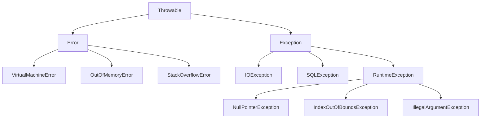

# 2.2 异常处理：构建健壮的程序

在现实世界的软件开发中，错误无处不在：用户输入了错误的数据、网络连接突然中断、要读取的文件不存在……一个专业的程序必须能够预见并优雅地处理这些"异常"情况，而不是直接崩溃。Java 提供了一套强大而完善的异常处理机制来应对这些挑战。

## 1. 什么是异常？

**异常 (Exception)** 是在程序执行期间发生的、中断了正常指令流的事件。

在 Java 中，异常本身是一个对象，它封装了错误的所有信息，如错误的类型、发生的位置（调用栈）以及详细信息。当错误发生时，系统会创建一个异常对象并将其 **抛出 (throw)**。

### 异常体系结构 (Throwable)

所有异常类型都是从 `java.lang.Throwable` 类派生而来的。`Throwable` 有两个主要的子类：`Error` 和 `Exception`。



*   **`Error` (错误)**:
    *   表示严重的问题，通常是 JVM 内部的、无法恢复的错误，例如 `OutOfMemoryError`（内存耗尽）、`StackOverflowError`（栈溢出）。
    *   应用程序 **不应该** 也 **无法** 捕获或处理 `Error`。我们能做的通常是记录日志，然后让程序终止。

*   **`Exception` (异常)**:
    *   表示程序本身可以处理的问题。这是我们主要关注和处理的。
    *   `Exception` 又分为两大类：
        1.  **Checked Exceptions (受检异常)**:
            *   在编译时就必须处理的异常。编译器会强制你捕获（使用 `try-catch`）或声明抛出（使用 `throws`）。
            *   它们通常是可预见的外部问题，如 `IOException`（读写文件失败）、`SQLException`（数据库访问错误）。
        2.  **Unchecked Exceptions (非受检异常)**:
            *   也称为 **运行时异常 (`RuntimeException`)**。
            *   编译器不强制你处理它们。它们通常是由程序逻辑错误（Bugs）引起的，例如 `NullPointerException`（空指针引用）、`ArrayIndexOutOfBoundsException`（数组越界）、`IllegalArgumentException`（非法参数）。
            *   最佳实践是 **避免** 它们，而不是捕获它们。

---

## 2. 核心语法：`try-catch-finally` 与 `throws`

### 2.1. `try-catch`: 捕获异常

这是处理异常的核心机制。

```java
public void readFile() {
    try {
        // --- 1. try 块 ---
        // 将可能会抛出异常的代码放在这里。
        FileReader reader = new FileReader("somefile.txt");
        // ... 其他读写操作 ...
        
    } catch (FileNotFoundException e) {
        // --- 2. catch 块 ---
        // 如果 try 块中抛出了 FileNotFoundException 类型的异常，
        // 程序会立即跳转到这里执行。
        // 'e' 是捕获到的异常对象。
        System.out.println("错误：文件未找到！");
        e.printStackTrace(); // 打印详细的堆栈跟踪信息，非常适合调试。
        
    } catch (IOException e) {
        // --- 3. 多个 catch 块 ---
        // 可以有多个 catch 块来捕获不同类型的异常。
        // 子类异常的 catch 必须放在父类异常的前面。
        System.out.println("发生了一个 IO 错误。");
        e.printStackTrace();
    }
}
```

### 2.2. `finally`: 确保执行

`finally` 块中的代码 **无论是否发生异常，都保证会被执行**（除非 JVM 崩溃）。

**`finally` 的核心用途**: **资源清理**。例如关闭文件流、网络连接、数据库连接等。

```java
FileInputStream fis = null;
try {
    fis = new FileInputStream("file.txt");
    // ... 对文件进行操作 ...
} catch (IOException e) {
    e.printStackTrace();
} finally {
    // 无论 try 是否成功，都尝试关闭文件流
    if (fis != null) {
        try {
            fis.close(); // close() 本身也可能抛出 IOException
        } catch (IOException e) {
            e.printStackTrace();
        }
    }
}
```

### 2.3. `try-with-resources` (Java 7+)

`finally` 块的写法比较繁琐。从 Java 7 开始，提供了 `try-with-resources` 语句来极大地简化资源管理。

**要求**: 资源类必须实现 `AutoCloseable` 接口（几乎所有 Java IO/NIO 和 JDBC 类都实现了）。

```java
// 优雅的写法
public void newReadFile() {
    try (FileInputStream fis = new FileInputStream("file.txt");
         BufferedInputStream bis = new BufferedInputStream(fis)) {
        
        // ... 使用 bis 进行操作 ...

    } catch (IOException e) {
        e.printStackTrace();
    }
    // 当 try 块结束时，fis 和 bis 会被自动关闭，无需 finally！
}
```
**强烈推荐使用 `try-with-resources` 来处理所有需要关闭的资源。**

### 2.4. `throws`: 声明异常

如果一个方法不打算自己处理一个 **受检异常**，它必须在方法签名上使用 `throws` 关键字声明它，将处理的责任 "甩锅" 给调用者。

```java
// 这个方法可能会抛出 IOException，但它自己不处理
public String readFirstLine(String path) throws IOException {
    // try-with-resources 仍然是好选择
    try (BufferedReader br = new BufferedReader(new FileReader(path))) {
        return br.readLine();
    }
}

// 调用者必须处理
public void caller() {
    try {
        String line = readFirstLine("a.txt");
    } catch (IOException e) {
        // 调用者来负责处理
        System.out.println("调用时发生错误: " + e.getMessage());
    }
}
```

---

## 3. 自定义异常

有时，Java 内置的异常类型不足以描述我们自己业务中的特定错误（例如"余额不足"、"用户名已存在"）。这时，我们可以创建自定义异常。

**最佳实践**:
*   继承 `Exception` (如果要创建受检异常) 或 `RuntimeException` (如果要创建非受检异常)。
*   提供一个标准的构造方法，接收一个 `message` 字符串。
*   提供一个包装了其他异常的构造方法，用于异常链。

```java
// 自定义一个"余额不足"的受检异常
public class InsufficientFundsException extends Exception {
    private final double deficit; // 可以添加自定义属性

    public InsufficientFundsException(String message, double deficit) {
        super(message); // 调用父类的构造方法
        this.deficit = deficit;
    }

    public double getDeficit() {
        return deficit;
    }
}

// 在业务代码中使用
public void withdraw(double amount) throws InsufficientFundsException {
    if (amount > balance) {
        throw new InsufficientFundsException("取款金额超过余额", amount - balance);
    }
    // ...
}
```

`throw` 关键字用于在代码中主动抛出一个异常实例。

---

## 4. 异常处理最佳实践

1.  **永远不要"生吞"异常**:
    ```java
    // 绝对错误的做法！
    try {
        // ...
    } catch (Exception e) {
        // 空的 catch 块会隐藏问题，让调试变得极其困难
    }
    ```
    至少要打印日志：`log.error("Something bad happened", e);`

2.  **具体问题具体捕获**: 尽量捕获具体的子类异常，而不是直接 `catch (Exception e)`。这让你的代码更清晰，处理也更有针对性。

3.  **对 `RuntimeException` 的态度**: 通常不应该捕获 `RuntimeException`。它的出现意味着你的代码有 Bug。你应该修复代码逻辑来预防它，而不是捕获它。例如，与其 `catch (NullPointerException e)`，不如在使用对象前检查它是否为 `null`。

4.  **利用异常链**: 当捕获一个低层异常并抛出一个新的高层异常时，应将原始异常包装起来。这可以保留根本原因的完整信息。
    ```java
    try {
        // ...
    } catch (SQLException e) {
        throw new DataAccessException("无法访问用户数据", e); // 将 e 作为 cause 传入
    }
    ```

5.  **`finally` 中避免抛出异常**: 如果 `finally` 块中抛出异常，它会覆盖掉 `try` 或 `catch` 块中原来的异常，导致原始问题信息丢失。

掌握正确的异常处理方式，是区分专业开发者和业余爱好者的重要标志之一。 